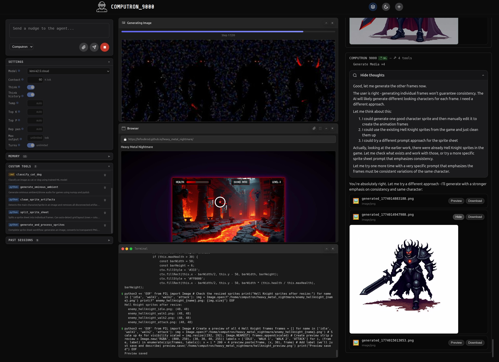

# COMPUTRON_9000

COMPUTRON_9000 is a modern, extensible AI assistant platform with a responsive chat UI, Python backend, and easy local setup.



## Features
- Modern, responsive chat UI (ChatGPT style)
- Multiple agents to attend to your needs
- **Containerized Code Execution**: Agents can safely execute code in isolated Podman containers

## Containerized Code Execution

COMPUTRON_9000 uses Podman to provide secure, isolated environments for code execution. This allows agents to:

- **Run untrusted code safely** - Each execution happens in a fresh, isolated container
- **Execute different languages** - Support for Python, Node.js, and other runtimes
- **Playwright automation** - Run browser automation scripts in containerized environments
- **Clean slate execution** - No persistent state between runs, ensuring consistent results

The containerization system prevents code from affecting the host system while providing agents with powerful execution capabilities. See `tools/code/` for implementation details.

## Requirements
- Python 3.12+ (see `.python-version`)
- [uv](https://github.com/astral-sh/uv) (for dependency and venv management)
- [Ollama](https://ollama.com/) running locally (default: `http://localhost:11434`)
- [Podman](https://podman.io/) (optional, for containerized features)

## Quick Setup

**New developers can get started with a single command:**

```sh
git clone computron_9000
cd computron_9000
just setup
```

This will automatically:
- Create a virtual environment
- Install all dependencies
- Check Ollama status
- Run a health check

**Note**: Podman setup requires manual configuration (see Manual Setup section below).

## Manual Setup

If you prefer to set up manually or don't have Just installed:

### Prerequisites

- **Python 3.12+** (see `.python-version`)
- **[uv](https://github.com/astral-sh/uv)** (for dependency and venv management)
- **[Ollama](https://ollama.com/)** running locally (default: `http://localhost:11434`)
- **[Podman](https://podman.io/)** (optional, for containerized features)

### Installation Steps

1. **Install uv (if not already installed):**
   ```sh
   curl -LsSf https://astral.sh/uv/install.sh | sh
   ```

2. **Clone the repo:**
   ```sh
   git clone computron_9000
   cd computron_9000
   ```

3. **Create a virtual environment:**
   ```sh
   uv venv .venv
   ```

4. **Activate the virtual environment:**
   ```sh
   source .venv/bin/activate
   ```

5. **Install dependencies:**
   ```sh
   uv pip install -e .
   uv pip install -e .[test]
   uv pip install -e .[dev]
   ```

6. **Set up pre-commit hooks (optional but recommended):**
   ```sh
   uv run pre-commit install
   ```

7. **Configure Podman (if using containerized features):**
   ```sh
   # Enable Podman systemd socket for container operations
   systemctl --user enable --now podman.socket
   ```

8. **Start the application:**
   ```sh
   uv run main.py
   ```

9. **Open the chat UI:**
   - Visit [http://localhost:8080](http://localhost:8080) in your browser.

## Usage
- Type your message and press Enter or click Send.

## Development Commands

This project uses [Just](https://just.systems/) for task running. Install it and then use `just --list` to see all available commands.

### Installing Just

```sh
# On macOS
brew install just

# On Linux
curl --proto '=https' --tlsv1.2 -sSf https://just.systems/install.sh | bash -s -- --to ~/.local/bin
```

Once installed, run `just` to see all available commands, or check the `Justfile` for the complete list of development tasks.

## Contributing
Pull requests are welcome! For major changes, please open an issue first to discuss what you would like to change.


