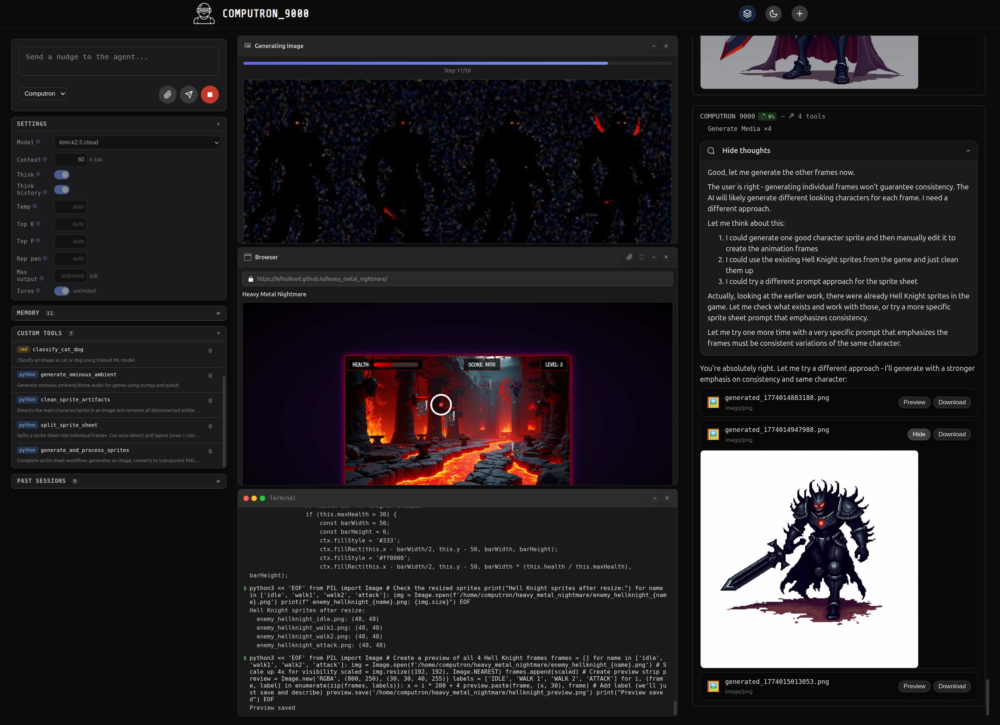

# COMPUTRON_9000

COMPUTRON_9000 is a self-hosted AI assistant with a Python/aiohttp backend, React frontend, and Ollama or Anthropic for LLM inference. It can browse the web, write and run code, control your desktop, generate media, and more — all running on your own hardware or with a remote Ollama instance.



## Features

- Multiple specialized agents:
  - **Browser agent** — full browser automation with human-like interactions (clicking, typing, scrolling, drag-and-drop, form filling, navigation). Uses a numbered-ref system for reliable element targeting and a structured DOM walker for page understanding.
  - **Desktop agent** — controls your Linux desktop via accessibility tree inspection, screenshots, mouse/keyboard actions, and vision-based visual grounding (UI-TARS model)
  - **Coding agent** — writes and executes Python code in a sandboxed Podman container
- Create, save, and reuse custom tools the assistant writes itself (persisted across restarts)
- **Autonomous task engine** — define goals with multi-step task pipelines that run in the background on a schedule or on-demand. Supports cron scheduling, task dependencies, parallel execution, automatic retries, and Telegram notifications.
- Persistent memory across sessions
- Conversation history with automatic context compaction (summarization)
- Sub-agent delegation for complex multi-step tasks
- Configurable browser headless/headed mode

## Hardware Requirements

**Minimum for LLM inference only:**
- 16 GB+ VRAM for smaller models, 48 GB+ recommended for larger models (e.g. `gpt-oss:120b`)
- Alternatively, use Ollama cloud models (e.g. `ollama pull qwen3:32b-cloud`) to skip local GPU entirely — requires an [Ollama account](https://ollama.com/) and being logged in (`ollama login`)

**For full feature set (local image/video generation + visual grounding):**
- NVIDIA GPU(s) with 12 GB+ VRAM for the inference container (image/video gen)
- Additional ~31 GB VRAM for the UI-TARS visual grounding model (desktop agent)
- The author runs this on 84 GB VRAM across 4 GPUs

You can use Ollama cloud models for all LLM inference (no local GPU needed), but image generation, video generation, and visual grounding require local NVIDIA GPU hardware with the Podman inference container.

## Requirements

- Python 3.12+ (see `.python-version`)
- [uv](https://github.com/astral-sh/uv) (dependency and venv management)
- [Ollama](https://ollama.com/) running locally (cloud models available with an Ollama account)
- [Just](https://just.systems/) (task runner)
- [Podman](https://podman.io/) (optional — for sandboxed code execution, media generation, and desktop agent)
- [Node.js](https://nodejs.org/) & npm (optional — for UI development)
- NVIDIA GPU + drivers (optional — only needed for local media generation and visual grounding)

## Quick Start

```sh
git clone <repo-url> computron_9000
cd computron_9000

# One-command setup: creates venv, installs deps, checks Ollama, installs Playwright
just setup

# Start the app
just run
```

Then open [http://localhost:8080](http://localhost:8080) in your browser.

### Using Ollama Cloud Models

If you don't have a local GPU, you can use Ollama's cloud-hosted models. Sign up at [ollama.com](https://ollama.com/), then:

```sh
ollama login
ollama pull qwen3:32b-cloud   # or any cloud-tagged model
```

Ollama still runs locally but inference happens in the cloud. Update `config.yaml` to reference the cloud model tags.

## Environment Configuration

Copy `.env.example` to `.env` and populate as needed:

| Variable | Purpose |
|----------|---------|
| `LLM_HOST` | Override Ollama host URL (default: `http://localhost:11434`) |
| `LLM_API_KEY` | Anthropic API key (when using `anthropic` provider) |
| `HF_TOKEN` | HuggingFace token for gated models (Flux.1-schnell) |
| `GITHUB_TOKEN/USER` | GitHub publishing (repos, Pages) |
| `TELEGRAM_BOT_TOKEN` | Telegram bot token for goal run notifications (via [@BotFather](https://t.me/BotFather)) |
| `TELEGRAM_CHAT_ID` | Telegram chat ID to receive notifications |

## Task Engine (Goals)

The task engine runs multi-step agent workflows autonomously in the background. Goals are created through the chat interface or the Goals panel in the sidebar.

**Key concepts:**
- **Goal** — a unit of work with one or more tasks (e.g. "Research and summarize today's AI news")
- **Task** — a single agent prompt with a designated agent (`computron`, `browser`, or `coder`), optional dependencies on other tasks
- **Run** — one execution of a goal's task pipeline. One-shot goals run immediately; recurring goals run on a cron schedule.

**Configuration** in `config.yaml`:
```yaml
goals:
  enabled: true
  poll_interval: 5       # seconds between runner ticks
  max_concurrent: 2      # max tasks running in parallel
  max_retries: 3         # retries per failed task
  timezone: America/Chicago
  model: "qwen3:32b-cloud"
  notifications:
    enabled: true        # requires TELEGRAM_BOT_TOKEN and TELEGRAM_CHAT_ID in .env
```

**Telegram notifications:** Set `TELEGRAM_BOT_TOKEN` and `TELEGRAM_CHAT_ID` in your `.env` file to receive notifications when goal runs complete or fail. Create a bot via [@BotFather](https://t.me/BotFather).

## Virtual Computer (Podman)

The sandboxed container provides code execution, media generation, and desktop environment tooling. Files are shared via a mounted volume configured by `virtual_computer.home_dir` in `config.yaml` (default: `~/.computron_9000/container_home/`).

```sh
just container-build     # build the container image
just container-start     # start the sandbox
just container-shell     # open a shell in the container
just container-stop      # stop the container
```

## GPU Media Generation

Requires an NVIDIA GPU (12 GB+ VRAM), a HuggingFace account, and the inference container.

**Models:**
- **Images**: [Flux.1-schnell](https://huggingface.co/black-forest-labs/FLUX.1-schnell) — 1024x1024, 4 inference steps
- **Video**: [Wan2.1-T2V-1.3B](https://huggingface.co/Wan-AI/Wan2.1-T2V-1.3B-Diffusers) — 480p/720p text-to-video
- **Voice/TTS**: [Kokoro-82M](https://github.com/thewh1teagle/kokoro-onnx) — lightweight TTS

**Setup:**
1. Accept the [Flux.1-schnell license](https://huggingface.co/black-forest-labs/FLUX.1-schnell) on HuggingFace
2. Add your HuggingFace token to `.env`: `HF_TOKEN=hf_...`
3. Build and start the inference container:
   ```sh
   just inference-build
   just inference-start
   ```

Model weights are downloaded on first use and cached in `~/.computron_9000/container_home/`. A persistent inference server keeps models loaded in VRAM and auto-shuts down after 10 minutes of inactivity.

## Development

```sh
just dev          # backend with auto-reload
just dev-full     # backend + React UI dev server
just ui-dev       # UI dev server only
just test         # run test suite
just format       # format code with ruff
just lint         # lint with ruff
just typecheck    # type check with mypy
just check        # all quality checks
just ci           # quality checks + tests
```

Run `just` to see all available commands.

## Contributing

Pull requests are welcome! For major changes, please open an issue first to discuss what you would like to change.
