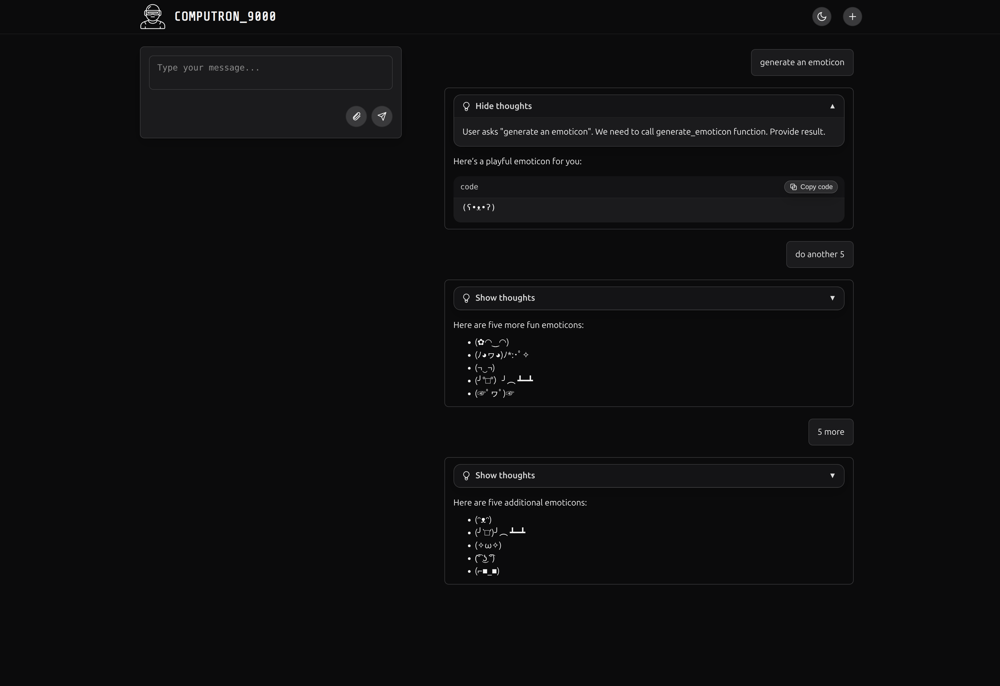

# COMPUTRON_9000

COMPUTRON_9000 is a modern, extensible AI assistant platform with a responsive chat UI, Python backend, and easy local setup.



## Features
- Modern, responsive chat UI
- Multiple agents to attend to your needs

## Virtual Computer

COMPUTRON_9000 can spin up a Podman container to give agents a sandboxed "virtual computer." This environment shares a volume with the host so files written by agents are accessible outside the container.

Common container commands:

```
just container-build    # build the container image
just container-start    # start the sandbox
just container-shell    # open a shell in the container
just container-stop     # stop the container
just container-status   # view container status
```

## Requirements
- Python 3.12+ (see `.python-version`)
- [uv](https://github.com/astral-sh/uv) (for dependency and venv management)
- [Ollama](https://ollama.com/) running locally (default: `http://localhost:11434`)
- [Podman](https://podman.io/) (optional, for the virtual computer)
- [Node.js](https://nodejs.org/) & npm (optional, for UI development)
- [Just](https://just.systems/) (for task automation)

## Quick Start

```sh
git clone computron_9000
cd computron_9000
just setup        # create venv, install deps, run health checks
just run          # start backend on http://localhost:8080
```

Helpful development commands:

```
just dev          # backend with auto-reload
just dev-full     # backend + React UI
just ui-dev       # UI dev server only
just test         # run test suite
just format       # format code
just lint         # lint with ruff
just typecheck    # type check with mypy
```

Run `just` to see all available tasks. Podman setup requires manual configuration (see Manual Setup below).

## Environment Configuration

Some integrations require additional credentials. Copy `.env.example` to `.env` and populate the following variables when you want to enable the related tools:

- **Reddit tools**: set `REDDIT_CLIENT_ID`, `REDDIT_CLIENT_SECRET`, and `REDDIT_USER_AGENT` to the values from your Reddit app. These credentials allow the Reddit integration to authenticate with the API.
- **Google search tools**: set `GOOGLE_SEARCH_API_KEY` and `GOOGLE_SEARCH_ENGINE_ID` (from your Programmable Search Engine) so the Google search utility can make authenticated requests.

Restart the backend after updating environment variables so the changes take effect.

## Manual Setup

If you prefer to set up manually or don't have Just installed:

### Prerequisites

- **Python 3.12+** (see `.python-version`)
- **[uv](https://github.com/astral-sh/uv)** (for dependency and venv management)
- **[Ollama](https://ollama.com/)** running locally (default: `http://localhost:11434`)
- **[Podman](https://podman.io/)** (optional, for containerized features)
- **[Node.js](https://nodejs.org/)** & npm (optional, for UI development)
- **[Just](https://just.systems/)** (for task automation)

### Installation Steps

1. **Install uv (if not already installed):**
   ```sh
   curl -LsSf https://astral.sh/uv/install.sh | sh
   ```

2. **Clone the repo:**
   ```sh
   git clone computron_9000
   cd computron_9000
   ```

3. **Create a virtual environment:**
   ```sh
   uv venv .venv
   ```

4. **Activate the virtual environment:**
   ```sh
   source .venv/bin/activate
   ```

5. **Install dependencies:**
   ```sh
   uv pip install -e .
   uv pip install -e .[test]
   uv pip install -e .[dev]
   ```

6. **Configure Podman (if using containerized features):**
   ```sh
   # Enable Podman systemd socket for container operations
   systemctl --user enable --now podman.socket
   ```

7. **Start the application:**
   ```sh
   uv run main.py
   ```

8. **Open the chat UI:**
   - Visit [http://localhost:8080](http://localhost:8080) in your browser.

## Usage
- Type your message and press Enter or click Send.

## Development Commands

This project uses [Just](https://just.systems/) for task running. Helpful recipes include:

```
just format       # format code with ruff
just lint         # lint the code
just typecheck    # mypy type checks
just test         # run tests
just check        # run format-check, lint and typecheck
just ci           # run all checks including tests
just ui-build     # build the React UI for production
```

Run `just --list` to see the full set of available commands.

## Contributing
Pull requests are welcome! For major changes, please open an issue first to discuss what you would like to change.


