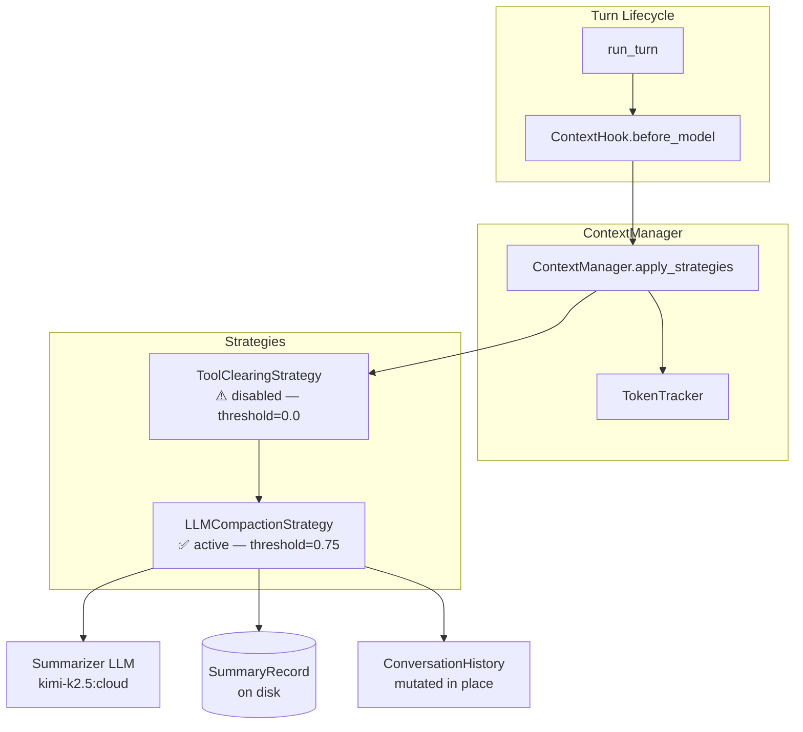
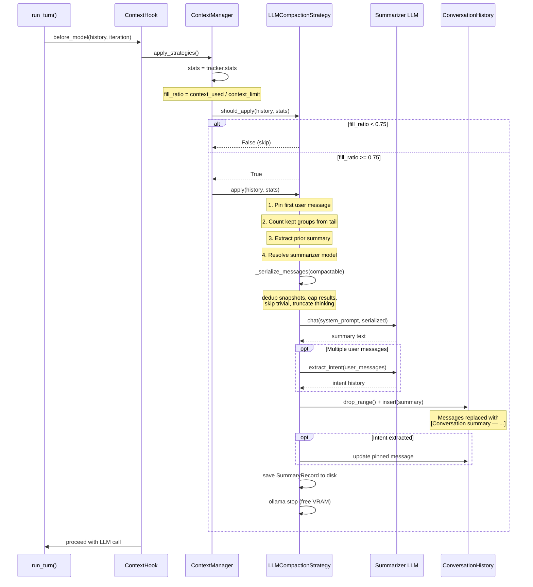
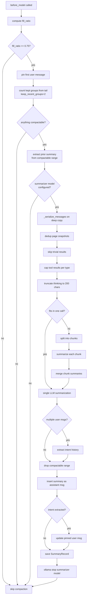
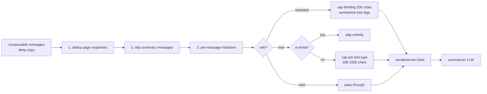

# Compaction Strategy

How Computron 9000 keeps conversations within the model's context window.

## Overview

As a conversation grows, the LLM's context window fills up. When usage exceeds a
configurable threshold, the compaction system summarizes older messages and
replaces them with a compact summary, preserving recent context verbatim.

Compaction runs **between turns** — triggered by `ContextHook.before_model`
before each LLM call. It operates on **message groups** to avoid splitting tool
calls from their results.

## Architecture



**Defined in:** `sdk/context/_strategy.py` (1,007 lines)
**Orchestrated by:** `sdk/context/_manager.py` (134 lines)
**Triggered by:** `sdk/hooks/_context_hook.py` (29 lines)

### Trigger Flow



### Algorithm Flowchart



## Message Groups

The fundamental unit of compaction. A **message group** is one assistant message
plus all its associated tool-call results. The compaction boundary is always
drawn at a group boundary — a tool result is never separated from the assistant
that called it. This prevents orphaned tool results that confuse the LLM.

`keep_recent_groups=2` means the two most recent assistant message groups are
preserved verbatim. Any user messages or other content interleaved between kept
groups are also preserved.

**Defined in:** `_count_kept_by_assistant_groups()` — walks backward from the
tail, counts assistant messages, sets the boundary before the Nth one found.

## LLMCompactionStrategy

The active compaction strategy. Aliased as `SummarizeStrategy` for backward
compatibility.

### Trigger

| Parameter | Default | Meaning |
|---|---|---|
| `threshold` | `0.75` | Fill ratio at which compaction activates |
| `keep_recent_groups` | `2` | Number of recent assistant groups to preserve |

`should_apply()` returns `True` when `stats.fill_ratio >= threshold`.

### Algorithm (`apply()`)

1. **Pin the first user message.** It's preserved across all compactions so the
   agent always knows why the conversation started.

2. **Determine the boundary.** `_count_kept_by_assistant_groups()` finds where
   the keep window starts. Messages before this boundary are *compactable*.

3. **Extract prior summary.** If a previous compaction's summary exists in the
   compactable range, it's extracted so facts can be merged forward.

4. **Resolve the summarizer model.** Model selection priority:
   - Explicit `summary_model` constructor argument
   - `compaction_model` from settings (set in the UI)
   - Falls back to `config.yaml` → `summary.model`
   - If none configured, compaction is **skipped entirely**.

5. **Summarize** via `_summarize()`:
   - Serializes compactable messages to text (see Serialization below)
   - If the serialized text fits in one call: single LLM summarization
   - If too long: **chunked summarization** — splits into chunks, summarizes
     each independently, then merges chunk summaries in a final pass
   - Prior summary is prepended to the first chunk only
   - Timeout: 180 seconds per LLM call

6. **Extract user intent** (if multiple user messages exist). When the user
   changed topics mid-conversation, the pinned first message becomes stale.
   An LLM call extracts a concise intent history showing how requests evolved,
   and the pinned message is updated with `[User intent history]\n...`.

7. **Persist a `SummaryRecord`** to `{conv_dir}/summaries/{id}.json` for
   offline quality evaluation. Contains: input messages, summary text, model,
   fill ratio, timing, agent name, conversation ID, and pre/post compaction
   user message content.

8. **Mutate the history.** `history.drop_range(start, end)` removes compactable
   messages, then `history.insert()` places the summary as an assistant message
   prefixed with `[Conversation summary — earlier messages were compacted]`.

9. **Unload the summarizer model** via `ollama stop` to free VRAM for the
   main agent.

### Serialization (`_serialize_messages()`)

Builds the text blob sent to the summarizer LLM. Applies these transformations
on a **deep copy** (the original history is not mutated here):



| Transformation | Detail |
|---|---|
| **Page snapshot dedup** | Only the last snapshot per URL is kept in full. Earlier duplicates become `[page snapshot — superseded by later snapshot]`. Query params are stripped for URL matching. |
| **Summary skip** | Prior summary messages (starting with `[Conversation summary`) are skipped regardless of role. |
| **Tool result capping** | Per-tool-type character caps (see below). Exceeding content gets `...` appended. |
| **Trivial result skip** | Empty results and known no-op patterns (`{"success": true`, etc.) are dropped. |
| **Thinking truncation** | Assistant thinking text is capped at 200 chars. |
| **Tool arg summarization** | Tool calls are rendered as `tool_name(path_or_key_arg)` using extracted argument keys. |

**Per-tool result caps:**

| Cap | Tools |
|---|---|
| 1500 chars | `read_file`, `grep`, `run_bash_cmd` |
| 800 chars | `list_dir`, `read_page` |
| 500 chars | `open_url`, `browse_page` |
| 400 chars | `apply_text_patch`, `replace_in_file`, `scroll_page` |
| 300 chars | `write_file` |
| 200 chars | `click`, `fill_field`, all others |

These caps were tuned experimentally (see `docs/summarizer_optimization/experiments.md`).
Higher caps (6k–40k) caused kimi-k2.5 to treat the input as an in-progress
coding task rather than a conversation to summarize. Agent messages already
synthesize key file contents, so raw tool results beyond ~1500 chars add noise.

### Summarizer Prompt

The system prompt instructs the model to produce a structured summary with
three required sections:

- **## Completed Work** — facts, findings, and results as bullet points
- **## Key Data** — URLs, prices, signatures, paths, error messages
- **## Current State** — what's happening right now, pending actions

The prompt includes domain-specific guidance for both browser research and code
analysis tasks, with WRONG/RIGHT examples for each. When a prior summary exists,
the model is instructed to re-condense and merge rather than copy verbatim.

### Intent Extraction

Triggered when the compactable range contains more than one user message.
Uses the same summarizer model (with `temperature=0`) and a 60-second timeout.
Individual messages are truncated to 500 chars. Output format: one line per
phase, current active request marked with `[CURRENT]`.

## ToolClearingStrategy

A lightweight, zero-LLM-cost pre-compaction step that clears old tool results
and truncates large tool-call arguments directly in the conversation history.

**Currently disabled** — `threshold=0.0` means `should_apply()` always returns
`False`. It was found to produce poor results in practice. The class remains
in the codebase but is effectively dead at all three call sites (main agent
turns, background tasks, sub-agents).

When it was active, it:
- Replaced processed tool results with `[tool result cleared]` (22 chars)
- Truncated tool-call arguments over 200 chars to `first_200...[N chars]`
- Only touched messages with a subsequent assistant message (already processed)
- Saved a `ClearingRecord` to `{conv_dir}/clearings/{id}.json` for audit

## Model Resolution

The summarizer uses a **separate model** from the main agent. Resolution order:

1. `summary_model` passed to `LLMCompactionStrategy()` constructor
2. `compaction_model` from settings (`~/.computron_9000/settings.json`)
3. `summary.model` from `config.yaml`
4. If none found: compaction is disabled (logged as warning)

Inference options (`num_ctx`, `num_predict`, `temperature`, etc.) come from
`config.yaml` → `summary.options`. The current production config uses
`kimi-k2.5:cloud` with `num_predict: 8192` and `temperature: 0.3`.

## Call Sites

`LLMCompactionStrategy` is instantiated at three locations, all with
`threshold` from the agent's `compaction_threshold` field:

| Location | File |
|---|---|
| Main agent turns | `server/message_handler.py:257` |
| Background tasks | `tasks/_executor.py:62` |
| Sub-agents | `sdk/tools/_spawn_agent.py:196` |

## Persistence

Every compaction produces a `SummaryRecord` saved to disk:

```
~/.computron_9000/conversations/{conv_id}/summaries/{uuid}.json
```

Records contain full-fidelity input messages and the generated summary,
enabling offline quality evaluation via the compaction eval web app
(`tools/compaction_eval/`).

## Related Documentation

- `docs/sdk_semantics.md` — Message Groups concept and turn lifecycle diagram
- `docs/hooks.md` — ContextHook description
- `docs/summarizer_optimization/experiments.md` — Prompt and model tuning history
- `docs/summarizer_optimization/run_prompt_eval.py` — A/B test runner for summarizer configs
