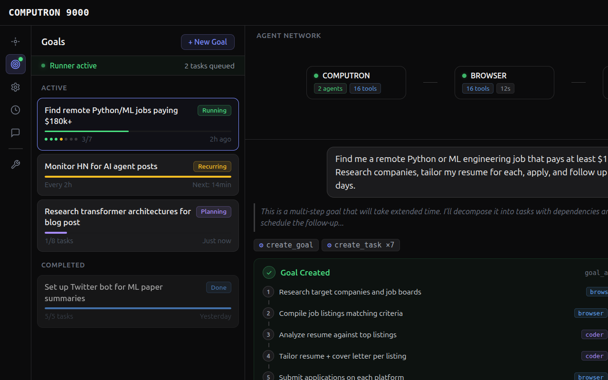
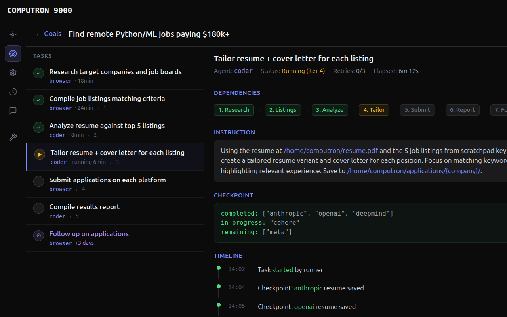

# Autonomous Task Engine — Implementation Plan

## 1. Overview

The Task Engine adds persistent, background-executing goals to Computron 9000. Today, all work is request-response: a user sends a message, agents work, they respond, and nothing happens until the next message. The task engine makes the system capable of autonomous long-running operation — decomposing goals into tasks, executing them in the background, self-correcting on failure, and scheduling future work.

### What this enables

| Use Case | How It Works |
|----------|-------------|
| "Find me a job" | Goal → research → tailor resume → apply → follow up in 3 days |
| "Monitor HN for X" | Recurring task every 2h → browser agent checks → saves to memory |
| "Play this browser game" | Goal with checkpoint/resume across many turns |
| "Post daily on Twitter" | Recurring goal → coder writes content → browser posts |
| "Research and write a report" | Multi-step with web research → synthesis → draft → revision |

### Design principles

1. **Build on what exists.** The turn execution loop, agent spawning, tools, hooks, events, and persistence are all solid. The task engine wraps these — it doesn't replace them.
2. **File-based where possible, SQLite where necessary.** The task store uses SQLite (stdlib `sqlite3`) because task queries (find ready tasks, check dependencies) are relational. Everything else stays file-based.
3. **Agents don't know about the engine.** Tasks are executed as normal agent turns with self-contained instructions. The engine is the orchestrator above the agents.
4. **Graceful degradation.** If the runner crashes, tasks persist in SQLite. On restart, it picks up where it left off. Checkpoints prevent re-doing completed work.

---

## 2. Core Concepts

### Goal

A high-level objective defined by the user or created by an agent.

```
Goal {
  id:          str (ulid)
  description: str
  status:      pending | planning | running | paused | completed | failed
  priority:    low | normal | high | urgent
  created_at:  datetime
  updated_at:  datetime
  started_at:  datetime | null
  completed_at: datetime | null
  metadata:    json (arbitrary user data)
}
```

### Task

An atomic unit of work that maps to a single agent turn.

```
Task {
  id:            str (ulid)
  goal_id:       str (FK → Goal)
  description:   str
  instruction:   str (full self-contained agent instruction)
  agent:         str (computron | browser | coder | desktop)
  status:        pending | ready | running | completed | failed | blocked | cancelled
  depends_on:    list[str] (task IDs)
  schedule:      Schedule | null
  checkpoint:    json | null (intermediate state)
  result:        str | null (output when completed)
  error:         str | null (error details when failed)
  retry_count:   int (default 0)
  max_retries:   int (default 3)
  created_at:    datetime
  started_at:    datetime | null
  completed_at:  datetime | null
  order:         int (execution priority within goal)
  conversation_id: str | null (which conversation created this)
}
```

### Schedule

When and how a task should be triggered.

```
Schedule {
  type:     immediate | delayed | recurring | after_task
  delay:    duration | null (for delayed: "30m", "3d")
  cron:     str | null (for recurring: "0 */2 * * *" = every 2h)
  after:    str | null (task_id to run after)
  next_run: datetime | null (computed next execution time)
}
```

### Checkpoint

Intermediate state saved during task execution, enabling resume-from-checkpoint on failure or restart.

```
Checkpoint {
  task_id:    str
  state:      json (arbitrary, task-specific)
  saved_at:   datetime
  iteration:  int (which tool-loop iteration)
}
```

---

## 3. Architecture

```
┌─────────────────────────────────────────────────────────────────────────────┐
│                              HTTP Layer                                     │
│  /api/goals, /api/goals/{id}/tasks, /api/runner/status                     │
└──────────────┬──────────────────────────────────────────┬──────────────────┘
               │                                          │
    ┌──────────▼──────────┐                    ┌──────────▼──────────┐
    │   Message Handler   │                    │    Task Runner      │
    │  (user-initiated    │                    │  (background loop)  │
    │   turns, as today)  │                    │                     │
    └──────────┬──────────┘                    └──────────┬──────────┘
               │                                          │
               │         ┌────────────────────┐           │
               └────────►│    Task Store      │◄──────────┘
                         │    (SQLite)        │
                         └────────┬───────────┘
                                  │
                    ┌─────────────┼─────────────┐
                    │             │             │
             ┌──────▼──┐  ┌──────▼──┐  ┌───────▼──────┐
             │  Goals   │  │  Tasks  │  │  Checkpoints │
             └─────────┘  └─────────┘  └──────────────┘

    Task Runner picks up ready tasks and executes them as agent turns:

    ┌─────────────────────────────────────────────────────────────┐
    │                     Task Execution                          │
    │                                                             │
    │   TaskRunner.run_task(task)                                  │
    │     │                                                       │
    │     ├─ Load goal context + checkpoint                       │
    │     ├─ Build self-contained instruction                     │
    │     ├─ Create conversation (or reuse goal's conversation)   │
    │     ├─ Execute agent turn (existing run_turn machinery)     │
    │     │    ├─ Hooks: all standard + TaskCheckpointHook        │
    │     │    └─ Tools: all standard + checkpoint, complete_task │
    │     ├─ On success: mark complete, unblock dependents        │
    │     ├─ On failure: self-correction → retry or escalate      │
    │     └─ Emit TaskEvents for UI                               │
    └─────────────────────────────────────────────────────────────┘
```

### New modules

```
tasks/                          # New top-level package
├── __init__.py                 # Public API re-exports
├── _store.py                   # SQLite-backed TaskStore
├── _models.py                  # Pydantic models (Goal, Task, Schedule, etc.)
├── _runner.py                  # Background TaskRunner (asyncio loop)
├── _executor.py                # Task → agent turn execution
├── _scheduler.py               # Schedule evaluation (cron, delays)
├── _self_correction.py         # Failure analysis and retry strategy
├── _planner.py                 # Goal → task decomposition (optional agent call)
└── _tools.py                   # Agent-callable tools (create_goal, etc.)

sdk/events/_models.py           # Add TaskEvent payloads
sdk/hooks/_task_hook.py         # TaskCheckpointHook
server/aiohttp_app.py           # Add /api/goals, /api/runner endpoints
server/ui/src/components/       # New UI components
```

---

## 4. Data Layer — TaskStore

SQLite via stdlib `sqlite3`, stored at `~/.computron_9000/tasks.db`.

### Schema

```sql
CREATE TABLE goals (
    id          TEXT PRIMARY KEY,
    description TEXT NOT NULL,
    status      TEXT NOT NULL DEFAULT 'pending',
    priority    TEXT NOT NULL DEFAULT 'normal',
    created_at  TEXT NOT NULL,
    updated_at  TEXT NOT NULL,
    started_at  TEXT,
    completed_at TEXT,
    metadata    TEXT DEFAULT '{}'
);

CREATE TABLE tasks (
    id              TEXT PRIMARY KEY,
    goal_id         TEXT NOT NULL REFERENCES goals(id),
    description     TEXT NOT NULL,
    instruction     TEXT NOT NULL DEFAULT '',
    agent           TEXT NOT NULL DEFAULT 'computron',
    status          TEXT NOT NULL DEFAULT 'pending',
    schedule_type   TEXT DEFAULT 'immediate',
    schedule_data   TEXT DEFAULT '{}',
    checkpoint      TEXT,
    result          TEXT,
    error           TEXT,
    retry_count     INTEGER NOT NULL DEFAULT 0,
    max_retries     INTEGER NOT NULL DEFAULT 3,
    created_at      TEXT NOT NULL,
    started_at      TEXT,
    completed_at    TEXT,
    task_order      INTEGER NOT NULL DEFAULT 0,
    conversation_id TEXT
);

CREATE TABLE task_dependencies (
    task_id    TEXT NOT NULL REFERENCES tasks(id),
    depends_on TEXT NOT NULL REFERENCES tasks(id),
    PRIMARY KEY (task_id, depends_on)
);

CREATE TABLE task_events (
    id        INTEGER PRIMARY KEY AUTOINCREMENT,
    task_id   TEXT NOT NULL REFERENCES tasks(id),
    event     TEXT NOT NULL,  -- 'started', 'checkpoint', 'completed', 'failed', 'retry', 'correction'
    data      TEXT DEFAULT '{}',
    timestamp TEXT NOT NULL
);

CREATE INDEX idx_tasks_goal ON tasks(goal_id);
CREATE INDEX idx_tasks_status ON tasks(status);
CREATE INDEX idx_task_events_task ON task_events(task_id);
```

### Key queries

```python
class TaskStore:
    def get_ready_tasks(self) -> list[Task]:
        """Tasks where: status='pending', all dependencies completed,
        and schedule allows execution now."""

    def mark_running(self, task_id: str) -> None
    def mark_completed(self, task_id: str, result: str) -> None
    def mark_failed(self, task_id: str, error: str) -> None
    def save_checkpoint(self, task_id: str, state: dict) -> None
    def get_unblocked_tasks(self, completed_task_id: str) -> list[Task]
    def get_goal_progress(self, goal_id: str) -> GoalProgress
```

---

## 5. Background Task Runner

An asyncio background task that runs inside the aiohttp server process. **Not** a separate process — this keeps things simple and lets us reuse the existing event loop, providers, and browser contexts.

### Lifecycle

```python
class TaskRunner:
    def __init__(self, store: TaskStore, config: RunnerConfig):
        self._store = store
        self._config = config
        self._running_tasks: dict[str, asyncio.Task] = {}
        self._stop_event = asyncio.Event()

    async def start(self) -> None:
        """Called from aiohttp on_startup. Starts the poll loop."""
        self._loop_task = asyncio.create_task(self._poll_loop())

    async def stop(self) -> None:
        """Called from aiohttp on_cleanup. Graceful shutdown."""
        self._stop_event.set()
        # Wait for running tasks to finish (with timeout)
        await asyncio.gather(*self._running_tasks.values(), return_exceptions=True)

    async def _poll_loop(self) -> None:
        while not self._stop_event.is_set():
            ready = self._store.get_ready_tasks()
            for task in ready:
                if len(self._running_tasks) >= self._config.max_concurrent:
                    break
                if task.id not in self._running_tasks:
                    self._running_tasks[task.id] = asyncio.create_task(
                        self._execute_task(task)
                    )
            # Clean up completed asyncio tasks
            done = [tid for tid, t in self._running_tasks.items() if t.done()]
            for tid in done:
                del self._running_tasks[tid]

            await asyncio.sleep(self._config.poll_interval)  # default: 5s

    async def _execute_task(self, task: Task) -> None:
        """Execute a single task as an agent turn."""
        executor = TaskExecutor(self._store)
        try:
            await executor.run(task)
        except Exception:
            # Self-correction handles retries internally
            # If we get here, it's an infrastructure error
            logger.exception("Task %s infrastructure failure", task.id)
            self._store.mark_failed(task.id, traceback.format_exc())
```

### Configuration

Added to `config.yaml`:

```yaml
tasks:
  enabled: true
  poll_interval: 5          # seconds between ready-task checks
  max_concurrent: 2         # max tasks running simultaneously
  max_retries: 3            # default retry limit per task
  retry_backoff_base: 30    # seconds, doubles each retry
  checkpoint_interval: 0    # 0 = agent-driven checkpoints only
```

---

## 6. Task Executor

Bridges the task engine to the existing turn execution machinery.

```python
class TaskExecutor:
    async def run(self, task: Task) -> None:
        goal = self._store.get_goal(task.goal_id)
        checkpoint = self._store.get_checkpoint(task.id)

        # 1. Build instruction
        instruction = self._build_instruction(task, goal, checkpoint)

        # 2. Create or reuse conversation
        conversation_id = f"task_{task.id}"

        # 3. Build agent from registry
        agent_config = _AGENT_REGISTRY[task.agent]
        agent = Agent(
            name=agent_config.name,
            description=agent_config.description,
            system_prompt=agent_config.system_prompt,
            tools=agent_config.tools + [self._checkpoint_tool(task.id)],
        )

        # 4. Set up hooks
        hooks = build_default_hooks(agent.name, model_options) + [
            TaskCheckpointHook(self._store, task.id),
        ]

        # 5. Execute turn (reuses existing run_turn)
        history = ConversationHistory([
            {"role": "system", "content": agent.system_prompt},
            {"role": "user", "content": instruction},
        ])

        async with turn_scope(handler=self._event_handler, conversation_id=conversation_id):
            async with agent_span(agent.name, instruction):
                result = await run_turn(history, agent, hooks)

        # 6. Handle result
        self._store.mark_completed(task.id, result)
        self._store.record_event(task.id, "completed", {"result_length": len(result)})

        # 7. Check if this unblocks other tasks
        unblocked = self._store.get_unblocked_tasks(task.id)
        for t in unblocked:
            self._store.update_status(t.id, "pending")  # ready for next poll

    def _build_instruction(self, task, goal, checkpoint) -> str:
        parts = [
            f"## Goal\n{goal.description}\n",
            f"## Task\n{task.instruction}\n",
        ]
        if checkpoint:
            parts.append(
                f"## Checkpoint (resume from here)\n"
                f"You previously made progress on this task. Here is your saved state:\n"
                f"```json\n{json.dumps(checkpoint.state, indent=2)}\n```\n"
                f"Continue from where you left off. Do not redo completed work.\n"
            )
        parts.append(
            "## Important\n"
            "- Use `checkpoint` to save progress after completing each significant step\n"
            "- Use `complete_task` when the task is fully done, with a summary of what was accomplished\n"
            "- If you encounter a blocker you cannot resolve, describe it clearly — "
            "the system will analyze it and may adjust your approach\n"
        )
        return "\n".join(parts)
```

---

## 7. Self-Correction System

When a task fails, the engine doesn't just retry blindly. It runs a **correction analysis** to understand what went wrong and adjust the approach.

### Flow

```
Task fails
  │
  ├─ retry_count >= max_retries?
  │   ├─ YES → mark failed, notify user
  │   └─ NO → continue
  │
  ├─ Classify failure:
  │   ├─ TRANSIENT (network, timeout, rate limit)
  │   │   → Simple retry with backoff, same instruction
  │   │
  │   ├─ CAPABILITY (can't login, needs human input, blocked by CAPTCHA)
  │   │   → Create notification task for user, mark blocked
  │   │
  │   ├─ APPROACH (wrong strategy, tool misuse, stuck in loop)
  │   │   → Run correction agent to analyze and revise instruction
  │   │
  │   └─ UNKNOWN
  │       → Run correction agent with full error context
  │
  └─ Execute retry (with backoff: base * 2^retry_count)
```

### Correction Agent

A lightweight agent turn that analyzes the failure and produces a revised strategy:

```python
class SelfCorrector:
    async def correct(self, task: Task, error: str, history: list[dict]) -> CorrectionResult:
        instruction = f"""
        A task has failed and needs correction.

        ## Original Task
        {task.instruction}

        ## Error
        {error}

        ## What The Agent Tried (last 5 tool calls)
        {self._format_recent_tools(history)}

        ## Your Job
        Analyze why this failed and produce a corrected approach:
        1. What was the root cause?
        2. What approach should be used instead?
        3. Should the instruction be modified? If so, provide the new instruction.
        4. Should this task be split into sub-tasks? If so, describe them.
        5. Does this require user intervention? (login credentials, CAPTCHA, etc.)

        Respond as JSON with keys: root_cause, classification (transient|capability|approach),
        revised_instruction (or null), new_sub_tasks (list or null), needs_user (bool), explanation.
        """

        # Run as a quick sub-agent turn
        result = await run_correction_agent(instruction)
        return CorrectionResult.model_validate_json(result)
```

### CorrectionResult actions

```python
match correction.classification:
    case "transient":
        # Retry with same instruction after backoff
        store.increment_retry(task.id)
        store.record_event(task.id, "retry", {"reason": "transient", ...})

    case "approach":
        # Retry with revised instruction
        if correction.revised_instruction:
            store.update_instruction(task.id, correction.revised_instruction)
        if correction.new_sub_tasks:
            for sub in correction.new_sub_tasks:
                store.create_task(goal_id=task.goal_id, **sub)
        store.increment_retry(task.id)
        store.record_event(task.id, "correction", {...})

    case "capability":
        # Needs human — create notification, mark blocked
        store.update_status(task.id, "blocked")
        store.create_task(
            goal_id=task.goal_id,
            description=f"User action needed: {correction.explanation}",
            agent="computron",
            instruction=correction.explanation,
        )
        publish_event(TaskNeedsAttentionPayload(task_id=task.id, ...))
```

---

## 8. Agent Tools

New tools available to the orchestrator agent (and sub-agents when appropriate).

### create_goal

```python
async def create_goal(description: str, priority: str = "normal") -> dict:
    """Create a new autonomous goal. The task runner will execute it in the background.

    Args:
        description: What you want to achieve. Be specific about success criteria.
        priority: Execution priority — 'low', 'normal', 'high', or 'urgent'.

    Returns:
        The created goal with its ID.
    """
```

### create_task

```python
async def create_task(
    goal_id: str,
    description: str,
    instruction: str,
    agent: str = "computron",
    depends_on: list[str] | None = None,
    schedule_type: str = "immediate",
    schedule_delay: str | None = None,
    schedule_cron: str | None = None,
) -> dict:
    """Add a task to a goal. Tasks execute in dependency order.

    Args:
        goal_id: The goal this task belongs to.
        description: Short description of what this task does.
        instruction: Full, self-contained instruction for the agent. Must include
            all context needed — the agent has no conversation history.
        agent: Which agent runs this — 'computron', 'browser', 'coder', 'desktop'.
        depends_on: List of task IDs that must complete before this one starts.
        schedule_type: 'immediate' (run when deps met), 'delayed' (wait),
            or 'recurring' (repeat on schedule).
        schedule_delay: For delayed tasks: '30m', '2h', '3d', etc.
        schedule_cron: For recurring tasks: cron expression like '0 */2 * * *'.

    Returns:
        The created task with its ID.
    """
```

### checkpoint

```python
async def checkpoint(state: str) -> dict:
    """Save intermediate progress. If this task fails or is interrupted,
    it will resume from this checkpoint instead of starting over.

    Args:
        state: JSON string describing current progress. Include what's done,
            what's in progress, and what remains.

    Returns:
        Confirmation with checkpoint timestamp.
    """
```

### complete_task

```python
async def complete_task(result: str) -> dict:
    """Mark the current task as successfully completed.

    Args:
        result: Summary of what was accomplished. This is stored and may be
            passed to dependent tasks as context.

    Returns:
        Confirmation. The runner will automatically start dependent tasks.
    """
```

### list_goals / list_tasks

```python
async def list_goals(status: str | None = None) -> dict:
    """List all goals, optionally filtered by status."""

async def list_tasks(goal_id: str) -> dict:
    """List all tasks for a goal with their current status and progress."""
```

### pause_goal / resume_goal

```python
async def pause_goal(goal_id: str) -> dict:
    """Pause a running goal. Running tasks complete, but no new tasks start."""

async def resume_goal(goal_id: str) -> dict:
    """Resume a paused goal."""
```

### Tool registration

These tools get added to the COMPUTRON agent's TOOLS list:

```python
# agents/computron/agent.py
from tasks import (
    create_goal, create_task, checkpoint, complete_task,
    list_goals, list_tasks, pause_goal, resume_goal,
)

TOOLS = [
    # ... existing tools ...
    create_goal,
    create_task,
    list_goals,
    list_tasks,
    pause_goal,
    resume_goal,
]

# checkpoint and complete_task are injected by TaskExecutor into task-execution agents only
```

---

## 9. Event Model

New event payloads for task lifecycle, added to `sdk/events/_models.py`:

```python
@dataclass
class TaskStartedPayload:
    type: str = "task_started"
    task_id: str
    goal_id: str
    description: str
    agent: str

@dataclass
class TaskCompletedPayload:
    type: str = "task_completed"
    task_id: str
    goal_id: str
    result_summary: str

@dataclass
class TaskFailedPayload:
    type: str = "task_failed"
    task_id: str
    goal_id: str
    error: str
    retry_count: int
    max_retries: int

@dataclass
class TaskCorrectionPayload:
    type: str = "task_correction"
    task_id: str
    classification: str  # transient, approach, capability
    explanation: str
    revised: bool

@dataclass
class TaskCheckpointPayload:
    type: str = "task_checkpoint"
    task_id: str
    summary: str  # human-readable checkpoint description

@dataclass
class GoalProgressPayload:
    type: str = "goal_progress"
    goal_id: str
    completed_tasks: int
    total_tasks: int
    status: str

@dataclass
class TaskNeedsAttentionPayload:
    type: str = "task_needs_attention"
    task_id: str
    goal_id: str
    reason: str
```

---

## 10. HTTP API

New endpoints in `server/aiohttp_app.py`:

```
GET    /api/goals                    → List goals (with optional ?status= filter)
POST   /api/goals                    → Create goal (from UI, bypassing chat)
GET    /api/goals/{id}               → Goal detail with task list
DELETE /api/goals/{id}               → Cancel and delete goal
PATCH  /api/goals/{id}               → Update goal (pause/resume/reprioritize)
GET    /api/goals/{id}/tasks         → List tasks for goal
GET    /api/goals/{id}/tasks/{tid}   → Task detail with events/checkpoint
GET    /api/runner/status            → Runner state (active tasks, queue depth)
POST   /api/runner/pause             → Pause the runner globally
POST   /api/runner/resume            → Resume the runner
GET    /api/runner/events            → SSE stream of task events (for live UI)
```

---

## 11. UI Design

### 11.1 Full Application — Goals Panel Open

The complete view showing the Goals flyout panel integrated into the existing app shell. The sidebar has a new target icon (with green notification dot when runner is active). The flyout shows all goals grouped by status, with the runner indicator, progress bars, and task dot indicators. The main content area continues to show the agent network, chat, and previews.



**Key elements:**
- **Sidebar:** New "Goals" icon (bullseye) with green notification dot when runner is active
- **Runner indicator in header:** "1 running / 2 queued" with pulsing green dot
- **Goals flyout:** Runner status bar, goal cards with status badges (Running, Scheduled, Planning, Done), progress bars, task dot indicators
- **Chat:** Shows the goal creation flow — user request, thinking, tool calls, rich goal-created card with task list and "Start Now" button
- **Previews:** Browser and terminal showing live task output
- **Toast:** Completion notification in bottom-right

### 11.2 Full Application — Goal Detail View

Clicking a goal opens a full detail view replacing the main content (like AgentActivityView). Three-pane layout: task list left, task detail center, previews right. The self-correction card shows how the system handles failures.



**Left pane — Task list:**
- Status icons (green checkmark=done, yellow play=running, gray dot=pending, purple clock=scheduled)
- Agent badges per task (`browser`, `coder`)
- Dependency arrows and elapsed times

**Center pane — Selected task detail:**
- Dependency chain visualization (done tasks struck through, current highlighted yellow)
- Self-contained instruction block
- Live checkpoint state (JSON showing completed/in-progress/remaining)
- Timeline with timestamps
- Self-correction card (from a previous task's failure → strategy adjustment)

**Right pane — Previews:**
- Browser showing the tailored resume being generated (with highlighted keywords)
- Terminal showing the tailor script output with progress

### 11.3 Component Details

Additional component-level mockups are available in the mockups directory:

- **[goals-sidebar.png](mockups/goals-sidebar.png)** — Goals flyout panel in isolation
- **[goal-detail.png](mockups/goal-detail.png)** — Goal detail two-pane view
- **[self-correction.png](mockups/self-correction.png)** — Self-correction flow: failure → analysis → strategy adjustment → retry
- **[task-runner-header.png](mockups/task-runner-header.png)** — Header indicator states (active/idle), dropdown, and toast notifications
- **[create-goal-chat.png](mockups/create-goal-chat.png)** — Goal creation flow in chat with rich card

---

## 12. Implementation Phases

### Phase 1: Foundation (Core store + runner + basic tools)

**Scope:** Get tasks persisting and executing in the background.

1. **`tasks/_models.py`** — Pydantic models for Goal, Task, Schedule, Checkpoint, GoalProgress
2. **`tasks/_store.py`** — SQLite TaskStore with all CRUD + query methods
3. **`tasks/_executor.py`** — TaskExecutor that bridges tasks to agent turns
4. **`tasks/_runner.py`** — Background poll loop, basic start/stop
5. **`tasks/_tools.py`** — `create_goal`, `create_task`, `complete_task`, `checkpoint`, `list_goals`, `list_tasks`
6. **`tasks/__init__.py`** — Public API re-exports
7. **Integration:** Wire runner into `aiohttp_app.py` startup/cleanup, add tools to COMPUTRON
8. **Config:** Add `tasks` section to config schema
9. **Tests:** Unit tests for store, executor, runner

**Exit criteria:** Can create a goal from chat, runner executes tasks sequentially, checkpoints persist.

### Phase 2: Dependencies + Scheduling

**Scope:** Task dependency graph and time-based scheduling.

1. **`tasks/_scheduler.py`** — Cron expression evaluation, delay calculation, next-run computation
2. **Store updates:** `get_ready_tasks()` respects dependencies and schedules
3. **Recurring tasks:** After completion, recurring tasks auto-create next instance
4. **Dependency resolution:** When task completes, mark dependents as ready
5. **Tests:** Dependency graph scenarios, schedule evaluation, recurring task lifecycle

**Exit criteria:** Tasks execute in dependency order. Delayed and recurring tasks work. "Do X every 2 hours" works.

### Phase 3: Self-Correction

**Scope:** Intelligent failure handling.

1. **`tasks/_self_correction.py`** — SelfCorrector with failure classification + correction agent
2. **Retry logic:** Exponential backoff with strategy-aware retries
3. **Instruction revision:** Failed approach tasks get revised instructions on retry
4. **Task splitting:** Correction agent can create sub-tasks
5. **Capability detection:** Blocked tasks notify user
6. **Events:** TaskCorrectionPayload, TaskNeedsAttentionPayload
7. **Tests:** Each failure classification path, correction agent mocking

**Exit criteria:** Tasks that fail due to wrong approach get corrected and succeed on retry. Capability blockers notify the user.

### Phase 4: HTTP API + Events

**Scope:** REST endpoints and real-time event streaming.

1. **API endpoints:** All routes from Section 10
2. **SSE stream:** `/api/runner/events` for live task updates
3. **Event integration:** TaskRunner publishes events via dispatcher
4. **Runner control:** Pause/resume from API
5. **Tests:** API endpoint tests

**Exit criteria:** Full CRUD on goals/tasks via API. Live event stream works.

### Phase 5: UI

**Scope:** All UI components from Section 11.

1. **GoalsPanel** — Sidebar flyout (goals list, runner status)
2. **GoalDetailView** — Full task list + detail two-pane view
3. **RunnerIndicator** — Header component with dropdown
4. **GoalCreatedCard** — Rich card in chat messages
5. **TaskToast** — Notification toasts for completions and attention-needed
6. **Sidebar icon** — New goals icon in sidebar
7. **State management** — Hooks for goals API + SSE event consumption

**Exit criteria:** Full UI as designed in mockups. Live updates via SSE.

### Phase 6: Polish + Advanced Features

**Scope:** Quality-of-life and advanced capabilities.

1. **Goal templates** — Pre-built decomposition patterns for common goal types
2. **Parallel task execution** — Tasks without dependencies run concurrently
3. **Goal conversation** — Dedicated conversation per goal for reviewing results
4. **Priority scheduling** — Urgent goals preempt lower-priority ones
5. **History cleanup** — Purge old completed goals and their data
6. **Rate limiting** — Configurable limits on runner resource usage

---

## 13. Testing Strategy

### Unit tests (`tests/tasks/`)

| Module | What to test |
|--------|-------------|
| `_store.py` | CRUD operations, ready-task queries, dependency resolution, concurrent access |
| `_models.py` | Pydantic validation, serialization round-trips |
| `_scheduler.py` | Cron evaluation, delay parsing, next-run calculation |
| `_self_correction.py` | Failure classification, correction result handling (mock the correction agent) |
| `_executor.py` | Instruction building with/without checkpoint, agent selection |
| `_runner.py` | Poll loop behavior, max concurrency, graceful shutdown |
| `_tools.py` | Tool function contracts, validation |

### Integration tests

- End-to-end: create goal → tasks execute → dependencies resolve → goal completes
- Failure + self-correction: task fails → correction → retry succeeds
- Checkpoint + resume: task checkpoints → kill → resume from checkpoint
- Recurring tasks: task completes → next instance auto-created → executes on schedule
- Runner lifecycle: start → execute tasks → pause → resume → stop

---

## 14. Risks & Mitigations

| Risk | Impact | Mitigation |
|------|--------|-----------|
| Runner crashes mid-task | Task stuck in "running" forever | On startup, reset stale "running" tasks to "pending" (with checkpoint) |
| Infinite correction loops | Burns tokens, never succeeds | Hard cap: max_retries applies to corrections too. After exhaustion, mark failed and notify user |
| Resource contention | Runner + interactive turns fight for Ollama | `max_concurrent` config limits runner parallelism. Interactive turns always take priority (runner can be auto-paused during user turns) |
| SQLite concurrency | Multiple asyncio tasks writing | Use WAL mode + connection-per-operation (SQLite handles this well for our scale) |
| Runaway token costs | Long-running goals burn through quota | Per-goal token budget (optional), tracked via ContextUsagePayload |
| Stale checkpoints | Checkpoint references deleted files | Checkpoints include file existence checks in instruction. Correction handles missing resources |

---

## 15. Future Directions (Out of Scope for V1)

- **Multi-machine execution** — Distribute tasks across worker nodes
- **Goal collaboration** — Multiple users contributing to a goal
- **Conditional triggers** — "Run this when stock drops below $X" (external event integration)
- **Goal learning** — Track which approaches work for which goal types, improve decomposition over time
- **Mobile notifications** — Push notifications for task completions and attention-needed events
