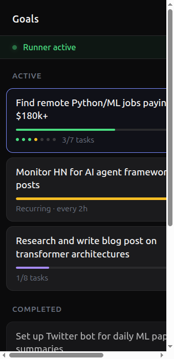

# Autonomous Task Engine — Implementation Plan

## 1. Overview

The Task Engine adds persistent, background-executing goals to Computron 9000. Today, all work is request-response: a user sends a message, agents work, they respond, and nothing happens until the next message. The task engine makes the system capable of autonomous long-running operation — decomposing goals into tasks, executing them in the background, and scheduling recurring work.

### What this enables

| Use Case | How It Works |
|----------|-------------|
| "Monitor HN for X" | Recurring goal every 2h → browser agent checks → writes report |
| "Find me a job" | Goal → research → tailor resume → apply |
| "Post daily on Twitter" | Recurring goal → coder writes content → browser posts |
| "Research and write a report" | Multi-step with web research → synthesis → draft → revision |

### Design principles

1. **Build on what exists.** The turn execution loop, agent spawning, tools, hooks, events, and persistence are all solid. The task engine wraps these — it doesn't replace them.
2. **File-based storage.** The task store uses JSON files on disk, consistent with how conversations are stored. The store interface is a protocol so it can be swapped to SQLite later if needed.
3. **User-driven planning, autonomous execution.** The user defines goals through a planning conversation (assisted by agents). Once created, the runner executes tasks autonomously in the background. Task-executing agents receive self-contained instructions and don't need to know they're part of a task engine.
4. **Immutable definitions.** Goals and tasks are immutable once created. To change a goal, create a new one (clone + modify). This eliminates edit logic and keeps the data model simple.
5. **Graceful degradation.** If the runner crashes, goals and runs persist on disk. On restart, stale running tasks are reset to pending and execution resumes.

---

## 2. Core Concepts

### Goal

An immutable template that defines what to accomplish. A goal is always a template that produces **runs**. A one-shot goal spawns a single run on creation. A recurring goal spawns a new run on each cron tick.

```
Goal {
  id:          str (ulid)
  description: str
  status:      active | paused
  cron:        str | null (e.g. "0 */2 * * *")
  created_at:  datetime
}
```

### Task

An immutable definition of a unit of work. Belongs to a goal. Tasks are the template — they define *what* to do but don't track execution state.

```
Task {
  id:           str (ulid)
  goal_id:      str (FK → Goal)
  description:  str
  instruction:  str (self-contained agent prompt)
  agent:        str ("computron", "browser", "coder", "desktop", or custom name)
  agent_config: json | null (inline agent: {system_prompt, tools})
  depends_on:   list[str] (task IDs — execution order)
  max_retries:  int (default 3)
}
```

**Agent resolution:** If `agent_config` is null, the executor looks up `agent` in `_AGENT_REGISTRY`. If `agent_config` is set, it defines the agent inline:

```
agent_config {
  system_prompt: str
  tools:         list[str] (tool names to include)
}
```

### Run

A single execution of a goal. References the goal and its tasks — does not copy them.

```
Run {
  id:           str (ulid)
  goal_id:      str (FK → Goal)
  run_number:   int (1, 2, 3, ...)
  status:       pending | running | completed | failed
  created_at:   datetime
  started_at:   datetime | null
  completed_at: datetime | null
}
```

### TaskResult

Per-run execution state for a single task. References a task definition and a run.

```
TaskResult {
  id:              str (ulid)
  run_id:          str (FK → Run)
  task_id:         str (FK → Task)
  status:          pending | running | completed | failed
  result:          str | null (agent output text)
  error:           str | null
  retry_count:     int (default 0)
  started_at:      datetime | null
  completed_at:    datetime | null
  conversation_id: str | null (conversation for this agent turn)
}
```

### Lifecycle

```
User chats with agent → agent creates Goal + Tasks
                              │
                              ▼
                   ┌── one-shot (no cron): spawn Run #1 immediately
                   │
                   └── recurring (cron set): spawn Run on each cron tick
                              │
                              ▼
                   Run created → TaskResults created (one per Task, status=pending)
                              │
                              ▼
                   Runner picks up ready TaskResults → executes as agent turns
                              │
                              ▼
                   All TaskResults done → Run marked completed (or failed)
```

---

## 3. Architecture

```
┌─────────────────────────────────────────────────────────────────────────────┐
│                              HTTP Layer                                     │
│  /api/goals, /api/goals/{id}/runs, /api/runner/status                      │
└──────────────┬──────────────────────────────────────────┬──────────────────┘
               │                                          │
    ┌──────────▼──────────┐                    ┌──────────▼──────────┐
    │   Goals/Tasks API   │                    │    Task Runner      │
    │  (read + delete)    │                    │  (background loop)  │
    └──────────┬──────────┘                    └──────────┬──────────┘
               │                                          │
               │         ┌────────────────────┐           │
               └────────►│    Task Store      │◄──────────┘
                         │  (JSON files)      │
                         └─────────────────────┘
```

### New modules

```
tasks/                          # New top-level package
├── __init__.py                 # Public API: init_store, get_store
├── _store.py                   # TaskStore protocol
├── _file_store.py              # File-based implementation (JSON on disk)
├── _models.py                  # Pydantic models (Goal, Task, Run, TaskResult, RunnerConfig)
├── _runner.py                  # Background TaskRunner (asyncio loop)
├── _executor.py                # TaskResult → agent turn execution
├── _scheduler.py               # Cron evaluation (via croniter)
└── _tools.py                   # Planning tools (create_goal, create_task)

agents/goal_planner/
├── __init__.py                 # Public exports
└── agent.py                    # GOAL_PLANNER agent + goal_planner_tool

server/_task_routes.py          # HTTP handlers for /api/goals, /api/runner
server/aiohttp_app.py           # Register task routes + runner startup/cleanup
server/ui/src/
├── hooks/useGoals.js                   # Goals API polling hook
└── components/goals/
    ├── GoalsPanel.jsx                  # Sidebar flyout (goal list)
    ├── GoalView.jsx                    # Full-screen layout (header + run list + detail)
    ├── RunDetail.jsx                   # Right pane: task results for a selected run
    └── GoalsIcon.jsx                   # Bullseye SVG icon
```

---

## 4. Data Layer — TaskStore

### Interface

The store is defined as a protocol so the backend can be swapped (file-based now, SQLite later if needed). All code depends on this interface, not the implementation.

```python
# tasks/_store.py

class TaskStore(Protocol):
    """Abstract store interface. All methods are synchronous."""

    # --- Goals ---
    def create_goal(self, description: str, cron: str | None = None) -> Goal: ...
    def get_goal(self, goal_id: str) -> Goal | None: ...
    def list_goals(self, status: str | None = None) -> list[Goal]: ...
    def set_goal_status(self, goal_id: str, status: str) -> None: ...
    def delete_goal(self, goal_id: str) -> list[str]:
        """Delete goal + all runs. Returns conversation_ids for cleanup."""

    # --- Tasks (immutable definitions) ---
    def create_task(self, goal_id: str, description: str, instruction: str,
                    agent: str, agent_config: dict | None, depends_on: list[str]) -> Task: ...
    def list_tasks(self, goal_id: str) -> list[Task]: ...
    def get_task(self, task_id: str) -> Task | None: ...

    # --- Runs ---
    def spawn_run(self, goal_id: str) -> Run: ...
    def get_run(self, run_id: str) -> Run | None: ...
    def get_goal_runs(self, goal_id: str) -> list[Run]: ...
    def update_run_status(self, run_id: str) -> str:
        """Recompute run status from task_results. Returns new status."""
    def delete_run(self, run_id: str) -> list[str]:
        """Delete run + task_results. Returns conversation_ids for cleanup."""

    # --- TaskResults (per-run execution state) ---
    def get_task_results(self, run_id: str) -> list[TaskResult]: ...
    def get_ready_task_results(self) -> list[tuple[TaskResult, Task]]:
        """Pending results whose deps are met, in active runs of active goals."""
    def mark_task_result_running(self, result_id: str) -> None: ...
    def mark_task_result_completed(self, result_id: str, result: str) -> None: ...
    def mark_task_result_failed(self, result_id: str, error: str) -> None: ...
    def increment_retry(self, result_id: str, error: str) -> None: ...
    def update_task_result_status(self, result_id: str, status: str) -> None: ...
    def set_conversation_id(self, result_id: str, conversation_id: str) -> None: ...
    def get_completed_results_for_tasks(self, run_id: str, task_ids: list[str]) -> list[tuple[str, str]]:
        """Returns (task.description, result_text) for completed deps in a run."""

    # --- Scheduling ---
    def get_due_recurring_goals(self) -> list[Goal]:
        """Active goals with cron, no in-progress run, and cron due since last run."""

    # --- Recovery ---
    def reset_stale_running(self) -> None:
        """Reset task_results stuck in 'running' back to 'pending'."""
```

### File-based implementation

JSON files on disk at `~/.computron_9000/goals/`. One file per goal, one file per run.

```
~/.computron_9000/goals/
├── {goal_id}.json                # { goal fields, tasks: [...] }
└── {goal_id}/
    └── runs/
        ├── {run_id}.json         # { run fields, task_results: [...] }
        └── ...
```

```python
# tasks/_file_store.py
import json
import shutil
from pathlib import Path


class FileTaskStore:
    """File-based TaskStore implementation. One JSON file per goal, one per run."""

    def __init__(self, base_dir: Path):
        self._base = base_dir
        self._base.mkdir(parents=True, exist_ok=True)

    # --- File layout ---

    def _goal_path(self, goal_id: str) -> Path:
        return self._base / f"{goal_id}.json"

    def _runs_dir(self, goal_id: str) -> Path:
        return self._base / goal_id / "runs"

    def _run_path(self, goal_id: str, run_id: str) -> Path:
        return self._runs_dir(goal_id) / f"{run_id}.json"

    # --- Atomic write ---

    def _write_json(self, path: Path, data: dict) -> None:
        path.parent.mkdir(parents=True, exist_ok=True)
        tmp = path.with_suffix(".tmp")
        tmp.write_text(json.dumps(data, indent=2))
        tmp.replace(path)

    def _read_json(self, path: Path) -> dict | None:
        if not path.exists():
            return None
        return json.loads(path.read_text())

    # --- Goals ---

    def create_goal(self, description: str, cron: str | None = None) -> Goal:
        goal = Goal(id=new_ulid(), description=description, status="active",
                    cron=cron, created_at=utcnow_iso())
        data = goal.model_dump()
        data["tasks"] = []
        self._write_json(self._goal_path(goal.id), data)
        return goal

    def get_goal(self, goal_id: str) -> Goal | None:
        data = self._read_json(self._goal_path(goal_id))
        if not data:
            return None
        return Goal(**{k: v for k, v in data.items() if k != "tasks"})

    def list_goals(self, status: str | None = None) -> list[Goal]:
        goals = []
        for p in self._base.glob("*.json"):
            data = self._read_json(p)
            if data and (status is None or data["status"] == status):
                goals.append(Goal(**{k: v for k, v in data.items() if k != "tasks"}))
        return sorted(goals, key=lambda g: g.created_at, reverse=True)

    def delete_goal(self, goal_id: str) -> list[str]:
        conv_ids = []
        # Collect conversation_ids from all runs
        runs_dir = self._runs_dir(goal_id)
        if runs_dir.exists():
            for rp in runs_dir.glob("*.json"):
                run_data = self._read_json(rp)
                if run_data:
                    for tr in run_data.get("task_results", []):
                        if tr.get("conversation_id"):
                            conv_ids.append(tr["conversation_id"])
        # Delete run directory and goal file
        goal_dir = self._base / goal_id
        if goal_dir.exists():
            shutil.rmtree(goal_dir)
        self._goal_path(goal_id).unlink(missing_ok=True)
        return conv_ids

    # --- Tasks ---

    def create_task(self, goal_id: str, description: str, instruction: str,
                    agent: str, agent_config: dict | None, depends_on: list[str]) -> Task:
        task = Task(id=new_ulid(), goal_id=goal_id, description=description,
                    instruction=instruction, agent=agent, agent_config=agent_config,
                    depends_on=depends_on, max_retries=3)
        # Append to goal file
        path = self._goal_path(goal_id)
        data = self._read_json(path)
        data["tasks"].append(task.model_dump())
        self._write_json(path, data)
        return task

    def list_tasks(self, goal_id: str) -> list[Task]:
        data = self._read_json(self._goal_path(goal_id))
        if not data:
            return []
        return [Task(**t) for t in data.get("tasks", [])]

    # --- Runs ---

    def spawn_run(self, goal_id: str) -> Run:
        # Determine next run number
        existing = self.get_goal_runs(goal_id)
        run_number = max((r.run_number for r in existing), default=0) + 1

        run = Run(id=new_ulid(), goal_id=goal_id, run_number=run_number,
                  status="pending", created_at=utcnow_iso())

        # Create a TaskResult for each Task definition
        tasks = self.list_tasks(goal_id)
        task_results = [
            TaskResult(id=new_ulid(), run_id=run.id, task_id=t.id, status="pending").model_dump()
            for t in tasks
        ]

        run_data = run.model_dump()
        run_data["task_results"] = task_results
        self._write_json(self._run_path(goal_id, run.id), run_data)
        return run

    def get_goal_runs(self, goal_id: str) -> list[Run]:
        runs_dir = self._runs_dir(goal_id)
        if not runs_dir.exists():
            return []
        runs = []
        for p in runs_dir.glob("*.json"):
            data = self._read_json(p)
            if data:
                runs.append(Run(**{k: v for k, v in data.items() if k != "task_results"}))
        return sorted(runs, key=lambda r: r.run_number)

    def delete_run(self, run_id: str) -> list[str]:
        # Find the run file (need to scan since run_id doesn't encode goal_id)
        for goal_dir in self._base.iterdir():
            if not goal_dir.is_dir():
                continue
            run_path = goal_dir / "runs" / f"{run_id}.json"
            if run_path.exists():
                data = self._read_json(run_path)
                conv_ids = [tr["conversation_id"] for tr in data.get("task_results", [])
                            if tr.get("conversation_id")]
                run_path.unlink()
                return conv_ids
        return []

    # --- TaskResults ---

    def get_ready_task_results(self) -> list[tuple[TaskResult, Task]]:
        """Scan all active goals' in-progress runs for pending results with deps met."""
        ready = []
        for goal in self.list_goals(status="active"):
            tasks = {t.id: t for t in self.list_tasks(goal.id)}
            for run in self.get_goal_runs(goal.id):
                if run.status not in ("pending", "running"):
                    continue
                run_data = self._read_json(self._run_path(goal.id, run.id))
                if not run_data:
                    continue
                results = run_data.get("task_results", [])
                completed_task_ids = {tr["task_id"] for tr in results if tr["status"] == "completed"}
                for tr_data in results:
                    if tr_data["status"] != "pending":
                        continue
                    task = tasks.get(tr_data["task_id"])
                    if not task:
                        continue
                    # Check all dependencies completed
                    if all(dep_id in completed_task_ids for dep_id in task.depends_on):
                        ready.append((TaskResult(**tr_data), task))
        return ready

    def _find_run(self, run_id: str) -> tuple[str, dict, Path]:
        """Locate a run file by run_id. Returns (goal_id, run_data, run_path)."""
        for goal_dir in self._base.iterdir():
            if not goal_dir.is_dir():
                continue
            run_path = goal_dir / "runs" / f"{run_id}.json"
            if run_path.exists():
                return goal_dir.name, self._read_json(run_path), run_path
        raise ValueError(f"Run {run_id} not found")

    def update_run_status(self, run_id: str) -> str:
        """Recompute run status from its task_results."""
        goal_id, run_data, run_path = self._find_run(run_id)
        statuses = [tr["status"] for tr in run_data.get("task_results", [])]

        if all(s == "completed" for s in statuses):
            new_status = "completed"
        elif any(s == "failed" for s in statuses) and not any(s in ("pending", "running") for s in statuses):
            new_status = "failed"
        elif any(s == "running" for s in statuses):
            new_status = "running"
        else:
            new_status = "pending"

        run_data["status"] = new_status
        if new_status in ("completed", "failed"):
            run_data["completed_at"] = utcnow_iso()
        self._write_json(run_path, run_data)
        return new_status

    # --- TaskResult mutations (all modify the run JSON file in place) ---

    def _mutate_task_result(self, result_id: str, fn: Callable[[dict], None]) -> None:
        """Find a task_result by ID across all runs, apply mutation, save."""
        for goal_dir in self._base.iterdir():
            if not goal_dir.is_dir():
                continue
            runs_dir = goal_dir / "runs"
            if not runs_dir.exists():
                continue
            for run_path in runs_dir.glob("*.json"):
                data = self._read_json(run_path)
                if not data:
                    continue
                for tr in data.get("task_results", []):
                    if tr["id"] == result_id:
                        fn(tr)
                        self._write_json(run_path, data)
                        return

    def mark_task_result_running(self, result_id: str) -> None:
        self._mutate_task_result(result_id, lambda tr: tr.update(
            status="running", started_at=utcnow_iso()))

    def mark_task_result_completed(self, result_id: str, result: str) -> None:
        self._mutate_task_result(result_id, lambda tr: tr.update(
            status="completed", result=result, completed_at=utcnow_iso()))

    def mark_task_result_failed(self, result_id: str, error: str) -> None:
        self._mutate_task_result(result_id, lambda tr: tr.update(
            status="failed", error=error, completed_at=utcnow_iso()))

    def increment_retry(self, result_id: str, error: str) -> None:
        self._mutate_task_result(result_id, lambda tr: tr.update(
            retry_count=tr.get("retry_count", 0) + 1, error=error))

    def set_conversation_id(self, result_id: str, conversation_id: str) -> None:
        self._mutate_task_result(result_id, lambda tr: tr.update(
            conversation_id=conversation_id))

    def get_completed_results_for_tasks(self, run_id: str, task_ids: list[str]) -> list[tuple[str, str]]:
        """Returns (task.description, result_text) for completed deps in a run."""
        goal_id, run_data, _ = self._find_run(run_id)
        tasks = {t.id: t for t in self.list_tasks(goal_id)}
        results = []
        for tr in run_data.get("task_results", []):
            if tr["task_id"] in task_ids and tr["status"] == "completed" and tr.get("result"):
                task = tasks.get(tr["task_id"])
                if task:
                    results.append((task.description, tr["result"]))
        return results

    # --- Scheduling ---

    def get_due_recurring_goals(self) -> list[Goal]:
        result = []
        for goal in self.list_goals(status="active"):
            if not goal.cron:
                continue
            runs = self.get_goal_runs(goal.id)
            # Skip if any run is still in progress
            if any(r.status in ("pending", "running") for r in runs):
                continue
            # Check if cron has fired since last completed run
            last_completed = max((r.completed_at for r in runs if r.completed_at), default=None)
            anchor = last_completed or goal.created_at
            if cron_has_fired_since(goal.cron, anchor):
                result.append(goal)
        return result

    # --- Recovery ---

    def reset_stale_running(self) -> None:
        """Reset task_results stuck in 'running' back to 'pending'."""
        for goal_dir in self._base.iterdir():
            if not goal_dir.is_dir():
                continue
            runs_dir = goal_dir / "runs"
            if not runs_dir.exists():
                continue
            for run_path in runs_dir.glob("*.json"):
                data = self._read_json(run_path)
                if not data:
                    continue
                changed = False
                for tr in data.get("task_results", []):
                    if tr["status"] == "running":
                        tr["status"] = "pending"
                        tr["started_at"] = None
                        changed = True
                if changed:
                    if data["status"] == "running":
                        data["status"] = "pending"
                    self._write_json(run_path, data)
```

The `_mutate_task_result` scan is O(goals × runs) but at our scale (dozens of goals, a few runs each) this is negligible. If it becomes a bottleneck, the store can be swapped to SQLite by implementing the same `TaskStore` protocol.

---

## 5. Background Task Runner

An asyncio background task that runs inside the aiohttp server process. **Not** a separate process — this keeps things simple and lets us reuse the existing event loop, providers, and browser contexts.

### Concurrency model

Multiple goals can be active concurrently. The concurrency limit is on **task executions**: the runner maintains a global pool of at most `max_concurrent` (default 2) task_results executing simultaneously, drawn from across all active runs.

### Implementation

```python
# tasks/_runner.py
import asyncio
import logging
import traceback

logger = logging.getLogger(__name__)


class TaskRunner:
    def __init__(self, store: TaskStore, executor: TaskExecutor, config: RunnerConfig):
        self._store = store
        self._executor = executor
        self._config = config
        self._running: dict[str, asyncio.Task] = {}  # task_result_id → asyncio.Task
        self._stop_event = asyncio.Event()
        self._paused = False

    async def start(self) -> None:
        """Called from aiohttp on_startup."""
        self._store.reset_stale_running()
        self._loop_task = asyncio.create_task(self._poll_loop())
        logger.info("Task runner started")

    async def stop(self) -> None:
        """Called from aiohttp on_cleanup."""
        self._stop_event.set()
        if self._running:
            logger.info("Waiting for %d running tasks", len(self._running))
            await asyncio.wait(self._running.values(), timeout=self._config.shutdown_timeout)

    def pause(self) -> None:
        self._paused = True

    def resume(self) -> None:
        self._paused = False

    @property
    def status(self) -> dict:
        return {
            "running": not self._paused and not self._stop_event.is_set(),
            "paused": self._paused,
            "active_tasks": len(self._running),
            "max_concurrent": self._config.max_concurrent,
        }

    async def _poll_loop(self) -> None:
        while not self._stop_event.is_set():
            if not self._paused:
                try:
                    await self._tick()
                except Exception:
                    logger.exception("Error in runner tick")
            await asyncio.sleep(self._config.poll_interval)

    async def _tick(self) -> None:
        # 1. Spawn runs for due recurring goals
        for goal in self._store.get_due_recurring_goals():
            run = self._store.spawn_run(goal.id)
            logger.info("Spawned run #%d for goal %s", run.run_number, goal.id)

        # 2. Pick up ready task results
        for task_result, task in self._store.get_ready_task_results():
            if len(self._running) >= self._config.max_concurrent:
                break
            if task_result.id not in self._running:
                self._store.mark_task_result_running(task_result.id)
                self._store.update_run_status(task_result.run_id)
                self._running[task_result.id] = asyncio.create_task(
                    self._execute(task_result, task)
                )

        # 3. Clean up finished asyncio tasks
        done = [trid for trid, t in self._running.items() if t.done()]
        for trid in done:
            del self._running[trid]

    async def _execute(self, task_result: TaskResult, task: Task) -> None:
        """Execute a task result. Handles retries."""
        try:
            result_text = await self._executor.run(task_result, task)
            self._store.mark_task_result_completed(task_result.id, result_text)
        except Exception:
            error_msg = traceback.format_exc()
            logger.exception("TaskResult %s failed", task_result.id)

            if task_result.retry_count < task.max_retries:
                delay = self._config.retry_backoff_base * (2 ** task_result.retry_count)
                self._store.increment_retry(task_result.id, error_msg)
                logger.info("TaskResult %s retry in %ds (%d/%d)",
                            task_result.id, delay, task_result.retry_count + 1, task.max_retries)
                await asyncio.sleep(delay)
                self._store.update_task_result_status(task_result.id, "pending")
            else:
                self._store.mark_task_result_failed(task_result.id, error_msg)

        # Recompute run status
        self._store.update_run_status(task_result.run_id)
```

### Configuration

New `RunnerConfig` in `config/__init__.py`:

```python
class GoalsConfig(BaseModel):
    enabled: bool = True
    goals_dir: str = ""  # empty = ~/.computron_9000/goals/
    poll_interval: int = 5
    max_concurrent: int = 2
    max_retries: int = 3
    retry_backoff_base: int = 30
    shutdown_timeout: int = 60
    # LLM options for task execution
    model: str = ""       # empty = use server default
    num_ctx: int = 0      # 0 = use model default
    think: bool = False
    max_iterations: int = 0
```

Add to `AppConfig`:

```python
class AppConfig(BaseModel):
    # ... existing fields ...
    goals: GoalsConfig = Field(default_factory=GoalsConfig)
```

Add to `config.yaml`:

```yaml
goals:
  enabled: true
  poll_interval: 5
  max_concurrent: 2
  max_retries: 3
  retry_backoff_base: 30
  model: "llama3.1:70b"     # model for task execution
  num_ctx: 16384
  think: false
  max_iterations: 0
```

---

## 6. Task Executor

Bridges a `TaskResult` + `Task` pair to the existing turn execution machinery.

```python
# tasks/_executor.py
import logging

from agents.types import Agent, LLMOptions
from config import load_config
from sdk.context import ConversationHistory
from sdk.events._context import agent_span, set_model_options
from sdk.hooks import default_hooks, PersistenceHook
from sdk.turn import run_turn, turn_scope
from server.message_handler import _AGENT_REGISTRY, _TOOL_REGISTRY

logger = logging.getLogger(__name__)


class TaskExecutor:
    def __init__(self, store: TaskStore):
        self._store = store

    def _get_llm_options(self) -> LLMOptions:
        """Build LLMOptions from GoalsConfig."""
        cfg = load_config().goals
        return LLMOptions(
            model=cfg.model or None,
            num_ctx=cfg.num_ctx or None,
            think=cfg.think or None,
            max_iterations=cfg.max_iterations or None,
        )

    async def run(self, task_result: TaskResult, task: Task) -> str:
        """Execute a task and return the result text."""
        run = self._store.get_run(task_result.run_id)
        goal = self._store.get_goal(run.goal_id)

        # 1. Build instruction (with predecessor results injected)
        instruction = self._build_instruction(task_result, task, goal)

        # 2. Assign conversation
        conversation_id = f"task_{task_result.id}"
        self._store.set_conversation_id(task_result.id, conversation_id)

        # 3. Build agent
        agent = self._build_agent(task)

        # 4. Set model options from goals config
        options = self._get_llm_options()
        set_model_options(options)

        # 5. Build hooks
        history = ConversationHistory([
            {"role": "system", "content": agent.instruction},
            {"role": "user", "content": instruction},
        ])
        hooks = default_hooks(agent, max_iterations=agent.max_iterations)
        hooks.append(PersistenceHook(conversation_id=conversation_id, history=history))

        # 6. Execute turn
        async with turn_scope(conversation_id=conversation_id):
            async with agent_span(agent.name, instruction=instruction):
                result = await run_turn(history, agent, hooks=hooks)

        return result or ""

    def _build_agent(self, task: Task) -> Agent:
        options = self._get_llm_options()

        if task.agent_config:
            config = task.agent_config if isinstance(task.agent_config, dict) else json.loads(task.agent_config)
            tool_names = config.get("tools", [])
            tools = [_TOOL_REGISTRY[n] for n in tool_names if n in _TOOL_REGISTRY]
            return Agent(
                name=task.agent,
                description=task.description,
                instruction=config.get("system_prompt", ""),
                tools=tools,
                model=options.model or "",
                options=options.to_options(),
            )

        if task.agent not in _AGENT_REGISTRY:
            logger.warning("Unknown agent %s, falling back to computron", task.agent)
        name, desc, prompt, tools = _AGENT_REGISTRY.get(task.agent, _AGENT_REGISTRY["computron"])
        return Agent(
            name=name, description=desc, instruction=prompt, tools=tools,
            model=options.model or "", options=options.to_options(),
        )

    def _build_instruction(self, task_result: TaskResult, task: Task, goal: Goal) -> str:
        """Build the agent instruction, injecting predecessor task results."""
        parts = [f"## Goal\n{goal.description}\n", f"## Task\n{task.instruction}\n"]

        # Inject results from completed dependency tasks
        deps = task.depends_on or []
        if deps:
            predecessor_results = self._store.get_completed_results_for_tasks(
                run_id=task_result.run_id, task_ids=deps,
            )
            if predecessor_results:
                parts.append("## Results from previous tasks\n")
                for desc, result_text in predecessor_results:
                    parts.append(f"### {desc}\n{result_text}\n")

        return "\n".join(parts)
```

The store method `get_completed_results_for_tasks(run_id, task_ids)` returns `list[tuple[str, str]]` — `(task.description, task_result.result)` for each completed dependency in the same run.

---

## 7. Failure Handling

Simple retry with exponential backoff, handled directly by the runner (Section 5).

```
TaskResult fails
  │
  ├─ retry_count >= max_retries?
  │   ├─ YES → mark_task_result_failed, update run status
  │   └─ NO → increment retry, sleep(backoff), reset to pending
  │
  └─ On retry: same instruction, same agent, new conversation
```

---

## 8. Goal & Task Creation

Goals and tasks are created through a **user-driven planning conversation**. The user chats with the root agent, describes what they want, and the agent decomposes it into a goal with tasks. Once created, everything is immutable. To change a goal, create a new one.

### Store access

```python
# tasks/__init__.py
from tasks._store import TaskStore

_store: TaskStore | None = None

def init_store(goals_dir: Path) -> FileTaskStore:
    global _store
    _store = FileTaskStore(goals_dir)
    return _store

def get_store() -> TaskStore:
    if _store is None:
        raise RuntimeError("TaskStore not initialized")
    return _store
```

### Planning tools

```python
# tasks/_tools.py
from tasks import get_store


async def create_goal(
    description: str,
    cron: str | None = None,
) -> dict:
    """Create a new goal. If cron is set, the goal recurs on that schedule.
    For one-shot goals (no cron), a run is spawned immediately.

    Args:
        description: What this goal accomplishes.
        cron: Cron expression for recurring goals (e.g. '0 */2 * * *').
    """
    store = get_store()
    goal = store.create_goal(description=description, cron=cron)
    # One-shot goals get their run immediately
    if not cron:
        store.spawn_run(goal.id)
    return goal.model_dump()


async def create_task(
    goal_id: str,
    description: str,
    instruction: str,
    agent: str = "computron",
    agent_config: dict | None = None,
    depends_on: list[str] | None = None,
) -> dict:
    """Add a task definition to a goal.

    Args:
        goal_id: The goal this task belongs to.
        description: Short description.
        instruction: Full, self-contained agent prompt. Must include all context
            needed — the executing agent has no conversation history.
        agent: Which agent runs this.
        agent_config: Optional inline agent definition with 'system_prompt' and 'tools'.
        depends_on: Task IDs that must complete before this one starts.
    """
    store = get_store()
    task = store.create_task(
        goal_id=goal_id, description=description, instruction=instruction,
        agent=agent, agent_config=agent_config, depends_on=depends_on or [],
    )
    return task.model_dump()


async def list_goals(status: str | None = None) -> dict:
    """List goals, optionally filtered by status."""
    store = get_store()
    goals = store.list_goals(status=status)
    return {"goals": [g.model_dump() for g in goals]}


async def list_tasks(goal_id: str) -> dict:
    """List task definitions for a goal."""
    store = get_store()
    tasks = store.list_tasks(goal_id)
    return {"tasks": [t.model_dump() for t in tasks]}
```

### Goal planner agent

A dedicated agent that owns the planning tools. COMPUTRON delegates to it via `run_goal_planner_as_tool`, the same pattern as `browser_agent_tool` and `computer_agent_tool`.

```python
# agents/goal_planner/agent.py
from textwrap import dedent

from sdk import make_run_agent_as_tool_function
from tasks._tools import create_goal, create_task, list_goals, list_tasks

NAME = "GOAL_PLANNER"
DESCRIPTION = "Plan and create autonomous goals with scheduled tasks"
SYSTEM_PROMPT = dedent("""
    You are GOAL_PLANNER, a planning agent for COMPUTRON 9000. Your job is to
    help the user define goals and decompose them into tasks.

    When the user describes what they want to accomplish:
    1. Create a goal with create_goal (add a cron expression if it should recur)
    2. Break it into tasks with create_task — each task must have a self-contained
       instruction that an agent can execute with no conversation history
    3. Set depends_on to define execution order between tasks
    4. Choose the right agent for each task:
       - "browser" for web browsing, scraping, form filling
       - "coder" for writing code, files, scripts, analysis
       - "computron" for general-purpose work
       - Or define a custom agent via agent_config

    Task instructions must be fully self-contained — the executing agent has no
    context beyond what you write in the instruction field. Include all URLs,
    file paths, criteria, and output expectations.

    For recurring goals, results from previous tasks in the same run are
    automatically injected into dependent tasks. Design task chains so that
    earlier tasks produce output that later tasks can build on.

    Return a summary of the goal and tasks you created.
""")
TOOLS = [
    create_goal,
    create_task,
    list_goals,
    list_tasks,
]

goal_planner_tool = make_run_agent_as_tool_function(
    name=NAME,
    description=DESCRIPTION,
    instruction=SYSTEM_PROMPT,
    tools=TOOLS,
)
```

```python
# agents/goal_planner/__init__.py
from .agent import DESCRIPTION, NAME, SYSTEM_PROMPT, TOOLS, goal_planner_tool

__all__ = ["DESCRIPTION", "NAME", "SYSTEM_PROMPT", "TOOLS", "goal_planner_tool"]
```

COMPUTRON gets the planner as a tool — it doesn't get the planning tools directly:

```python
# agents/computron/agent.py — add to TOOLS list:
from agents.goal_planner import goal_planner_tool

TOOLS = [
    # ... existing tools ...
    goal_planner_tool,
]
```

Also register in the agent registry so the task executor can look it up:

```python
# server/message_handler.py — add to _AGENT_REGISTRY:
from agents.goal_planner import (
    NAME as _PLANNER_NAME, DESCRIPTION as _PLANNER_DESCRIPTION,
    SYSTEM_PROMPT as _PLANNER_PROMPT, TOOLS as _PLANNER_TOOLS,
)

_AGENT_REGISTRY["goal_planner"] = (_PLANNER_NAME, _PLANNER_DESCRIPTION, _PLANNER_PROMPT, _PLANNER_TOOLS)
```

### Future: autonomous goal creation

Once we have agent-to-agent feedback mechanisms, agents will be able to create goals on their own mid-turn. Out of scope here.

---

## 9. Notifications (Future)

No push notifications in V1. The UI polls the API for current state.

Future: Telegram integration will allow the runner to push notifications for goal completion, failure, and other lifecycle events.

---

## 10. HTTP API

### Route registration

```python
# server/_task_routes.py
from aiohttp import web

def register_task_routes(app: web.Application) -> None:
    app.router.add_route("GET",    "/api/goals",                         handle_list_goals)
    app.router.add_route("POST",   "/api/goals",                         handle_create_goal)
    app.router.add_route("GET",    "/api/goals/{goal_id}",               handle_get_goal)
    app.router.add_route("DELETE", "/api/goals/{goal_id}",               handle_delete_goal)
    app.router.add_route("POST",   "/api/goals/{goal_id}/pause",         handle_pause_goal)
    app.router.add_route("POST",   "/api/goals/{goal_id}/resume",        handle_resume_goal)
    app.router.add_route("GET",    "/api/goals/{goal_id}/runs",          handle_list_runs)
    app.router.add_route("DELETE", "/api/goals/{goal_id}/runs/{run_id}", handle_delete_run)
    app.router.add_route("GET",    "/api/runner/status",                 handle_runner_status)
    app.router.add_route("POST",   "/api/runner/pause",                  handle_runner_pause)
    app.router.add_route("POST",   "/api/runner/resume",                 handle_runner_resume)
```

No PATCH/update routes — goals and tasks are immutable.

### Handler implementations

```python
from tasks import get_store
from conversations import delete_conversation


async def handle_list_goals(request: web.Request) -> web.Response:
    status = request.query.get("status")
    goals = get_store().list_goals(status=status)
    return web.json_response({"goals": [g.model_dump() for g in goals]})


async def handle_create_goal(request: web.Request) -> web.Response:
    body = await request.json()
    store = get_store()
    goal = store.create_goal(description=body["description"], cron=body.get("cron"))
    if not goal.cron:
        store.spawn_run(goal.id)
    return web.json_response(goal.model_dump(), status=201)


async def handle_get_goal(request: web.Request) -> web.Response:
    goal_id = request.match_info["goal_id"]
    store = get_store()
    goal = store.get_goal(goal_id)
    if not goal:
        return web.json_response({"error": "Not found"}, status=404)
    tasks = store.list_tasks(goal_id)
    runs = store.get_goal_runs(goal_id)
    # Include task_results for each run
    runs_data = []
    for run in runs:
        results = store.get_task_results(run.id)
        runs_data.append({
            **run.model_dump(),
            "task_results": [tr.model_dump() for tr in results],
        })
    return web.json_response({
        "goal": goal.model_dump(),
        "tasks": [t.model_dump() for t in tasks],
        "runs": runs_data,
    })


async def handle_delete_goal(request: web.Request) -> web.Response:
    goal_id = request.match_info["goal_id"]
    conv_ids = get_store().delete_goal(goal_id)
    for cid in conv_ids:
        delete_conversation(cid)
    return web.json_response({"deleted": goal_id})


async def handle_pause_goal(request: web.Request) -> web.Response:
    goal_id = request.match_info["goal_id"]
    get_store().set_goal_status(goal_id, "paused")
    return web.json_response({"status": "paused"})


async def handle_resume_goal(request: web.Request) -> web.Response:
    goal_id = request.match_info["goal_id"]
    get_store().set_goal_status(goal_id, "active")
    return web.json_response({"status": "active"})


async def handle_list_runs(request: web.Request) -> web.Response:
    goal_id = request.match_info["goal_id"]
    store = get_store()
    runs = store.get_goal_runs(goal_id)
    result = []
    for run in runs:
        results = store.get_task_results(run.id)
        result.append({**run.model_dump(), "task_results": [tr.model_dump() for tr in results]})
    return web.json_response({"runs": result})


async def handle_delete_run(request: web.Request) -> web.Response:
    run_id = request.match_info["run_id"]
    conv_ids = get_store().delete_run(run_id)
    for cid in conv_ids:
        delete_conversation(cid)
    return web.json_response({"deleted": run_id})


async def handle_runner_status(request: web.Request) -> web.Response:
    return web.json_response(request.app["task_runner"].status)


async def handle_runner_pause(request: web.Request) -> web.Response:
    request.app["task_runner"].pause()
    return web.json_response({"paused": True})


async def handle_runner_resume(request: web.Request) -> web.Response:
    request.app["task_runner"].resume()
    return web.json_response({"paused": False})
```

### Startup / cleanup wiring

```python
# server/aiohttp_app.py — add to create_app()

from tasks import init_store
from tasks._runner import TaskRunner
from tasks._executor import TaskExecutor


async def _start_task_runner(app: web.Application) -> None:
    config = load_config()
    if not config.goals.enabled:
        return
    goals_dir = Path(config.goals.goals_dir or Path.home() / ".computron_9000" / "goals")
    store = init_store(goals_dir)
    executor = TaskExecutor(store)
    runner = TaskRunner(store, executor, config.goals)
    app["task_runner"] = runner
    await runner.start()


async def _stop_task_runner(app: web.Application) -> None:
    runner = app.get("task_runner")
    if runner:
        await runner.stop()


def create_app(...) -> web.Application:
    app = web.Application(...)
    # ... existing routes ...
    register_task_routes(app)
    app.on_startup.append(_start_task_runner)
    app.on_cleanup.append(_stop_task_runner)
    return app
```

---

## 11. UI Design

With the unified model, there is **one view component** for all goals. Every goal shows its runs and task results — a one-shot goal simply has one run.

### 11.1 Goals Panel (Sidebar Flyout)



The sidebar gets a new "Goals" icon (bullseye). Clicking it opens the goals flyout showing all goals with status badges, cron schedules, and run counts. Runner pause/resume control at the top.

### 11.2 Goal View

Clicking a goal opens a full detail view replacing the main content (like AgentActivityView). Two-pane layout: run history left, selected run's task results right.


**Header:**
- Goal name, cron badge (if recurring), Pause and Delete buttons

**Left pane — Run list:**
- Runs with status icons, timestamps, durations
- Delete button (×) on hover
- One-shot goals show a single run here

**Right pane — Task results for selected run:**
- Each task with status icon, description, agent badge, duration
- Result text inline in styled block
- Error text in red-tinted block for failures

**Deletion:**
- **Delete a run** — deletes run, task_results, conversations
- **Delete goal** — cascading delete of everything

### 11.3 Implementation Details

#### New files

```
server/ui/src/
├── hooks/useGoals.js                       # Polling + CRUD
└── components/goals/
    ├── GoalsPanel.jsx                      # Sidebar flyout (goal list)
    ├── GoalsPanel.module.css
    ├── GoalView.jsx                        # Full-screen layout shell
    ├── GoalView.module.css
    ├── RunDetail.jsx                       # Task results for a selected run
    ├── RunDetail.module.css
    └── GoalsIcon.jsx                       # Bullseye SVG icon
```

#### Sidebar modification

Add to `Sidebar.jsx` PANELS array:

```jsx
{ id: 'goals', icon: <GoalsIcon /> },  // from components/goals/GoalsIcon
```

#### useGoals hook

```js
// server/ui/src/hooks/useGoals.js
import { useState, useEffect, useCallback } from 'react';

const POLL_INTERVAL = 5000;

export function useGoals() {
    const [goals, setGoals] = useState([]);
    const [runnerStatus, setRunnerStatus] = useState(null);
    const [selectedGoalId, setSelectedGoalId] = useState(null);

    useEffect(() => {
        let active = true;
        const poll = async () => {
            const [goalsRes, runnerRes] = await Promise.all([
                fetch('/api/goals').then(r => r.json()).catch(() => null),
                fetch('/api/runner/status').then(r => r.json()).catch(() => null),
            ]);
            if (active) {
                if (goalsRes) setGoals(goalsRes.goals);
                if (runnerRes) setRunnerStatus(runnerRes);
            }
        };
        poll();
        const id = setInterval(poll, POLL_INTERVAL);
        return () => { active = false; clearInterval(id); };
    }, []);

    const fetchGoalDetail = useCallback(async (goalId) => {
        const res = await fetch(`/api/goals/${goalId}`);
        return res.json();
    }, []);

    const deleteGoal = useCallback(async (goalId) => {
        await fetch(`/api/goals/${goalId}`, { method: 'DELETE' });
        setGoals(prev => prev.filter(g => g.id !== goalId));
        if (selectedGoalId === goalId) setSelectedGoalId(null);
    }, [selectedGoalId]);

    const deleteRun = useCallback(async (goalId, runId) => {
        await fetch(`/api/goals/${goalId}/runs/${runId}`, { method: 'DELETE' });
    }, []);

    return {
        goals, runnerStatus, selectedGoalId, setSelectedGoalId,
        fetchGoalDetail, deleteGoal, deleteRun,
        hasActiveGoals: runnerStatus?.active_tasks > 0,
    };
}
```

#### View switching in DesktopApp.jsx

```jsx
import { useGoals } from './hooks/useGoals';
import GoalView from './components/goals/GoalView';

// Inside component:
const goalsState = useGoals();
const selectedGoal = goalsState.goals.find(g => g.id === goalsState.selectedGoalId);

// In JSX — goal view takes priority over agent view:
{selectedGoal ? (
    <GoalView
        goal={selectedGoal}
        onBack={() => { goalsState.setSelectedGoalId(null); setFlyoutPanel('goals'); }}
        onDeleteGoal={() => goalsState.deleteGoal(selectedGoal.id)}
        onDeleteRun={(runId) => goalsState.deleteRun(selectedGoal.id, runId)}
        fetchDetail={() => goalsState.fetchGoalDetail(selectedGoal.id)}
    />
) : selectedAgent ? (
    <AgentActivityView ... />
) : (
    /* existing network / chat views */
)}
```

#### GoalView component

Layout shell — header, run list on the left, `RunDetail` on the right:

```jsx
// server/ui/src/components/goals/GoalView.jsx
import RunDetail from './RunDetail';

export default function GoalView({ goal, onBack, onDeleteGoal, onDeleteRun, fetchDetail }) {
    const [detail, setDetail] = useState(null);
    const [selectedRunId, setSelectedRunId] = useState(null);

    useEffect(() => {
        fetchDetail().then(data => {
            setDetail(data);
            if (data.runs?.length && !selectedRunId) {
                setSelectedRunId(data.runs[data.runs.length - 1].id);
            }
        });
        const id = setInterval(() => fetchDetail().then(setDetail), 5000);
        return () => clearInterval(id);
    }, [goal.id]);

    const selectedRun = detail?.runs?.find(r => r.id === selectedRunId);

    return (
        <div className={styles.container}>
            {/* Header */}
            <div className={styles.header}>
                <button className={styles.backBtn} onClick={onBack}>← Goals</button>
                <span className={styles.title}>{goal.description}</span>
                {goal.cron && <span className={styles.cronBadge}>{goal.cron}</span>}
                <button className={styles.deleteBtn} onClick={onDeleteGoal}>Delete</button>
            </div>

            <div className={styles.body}>
                {/* Left pane: run list */}
                <div className={styles.runsPane}>
                    <div className={styles.paneLabel}>Runs</div>
                    {detail?.runs?.map(run => (
                        <div
                            key={run.id}
                            className={`${styles.runItem} ${run.id === selectedRunId ? styles.selected : ''}`}
                            onClick={() => setSelectedRunId(run.id)}
                        >
                            <StatusIcon status={run.status} />
                            <div className={styles.runInfo}>
                                <div>Run #{run.run_number}</div>
                                <div className={styles.runTime}>{formatTime(run.created_at)}</div>
                            </div>
                            <button className={styles.deleteRunBtn}
                                onClick={e => { e.stopPropagation(); onDeleteRun(run.id); }}>×</button>
                        </div>
                    ))}
                </div>

                {/* Right pane: selected run's task results */}
                <div className={styles.detailPane}>
                    {selectedRun ? (
                        <RunDetail run={selectedRun} tasks={detail?.tasks} />
                    ) : (
                        <div className={styles.placeholder}>Select a run</div>
                    )}
                </div>
            </div>
        </div>
    );
}
```

#### RunDetail component

Renders task results for a single run:

```jsx
// server/ui/src/components/goals/RunDetail.jsx

export default function RunDetail({ run, tasks }) {
    const taskMap = useMemo(() => Object.fromEntries((tasks || []).map(t => [t.id, t])), [tasks]);

    return (
        <div className={styles.container}>
            <div className={styles.runHeader}>
                <span className={styles.runTitle}>Run #{run.run_number}</span>
                <span className={styles.runMeta}>
                    {formatTime(run.created_at)}
                    {run.completed_at && ` · ${formatDuration(run.started_at, run.completed_at)}`}
                    {' · '}{run.task_results?.filter(tr => tr.status === 'completed').length}
                    /{run.task_results?.length} tasks
                </span>
            </div>
            {run.task_results?.map(tr => {
                const task = taskMap[tr.task_id];
                return (
                    <div key={tr.id} className={styles.taskResult}>
                        <div className={styles.taskHeader}>
                            <StatusIcon status={tr.status} />
                            <span className={styles.taskName}>{task?.description}</span>
                            <span className={styles.agentBadge}>{task?.agent}</span>
                            {tr.completed_at && (
                                <span className={styles.duration}>
                                    {formatDuration(tr.started_at, tr.completed_at)}
                                </span>
                            )}
                        </div>
                        {tr.result && <div className={styles.resultText}>{tr.result}</div>}
                        {tr.error && <div className={styles.errorText}>{tr.error}</div>}
                    </div>
                );
            })}
        </div>
    );
}
```

---

## 12. Implementation Plan

### Dependencies

Add to `pyproject.toml`:

```toml
[project]
dependencies = [
    # ... existing ...
    "croniter>=1.3",
]
```

### Backend — build order

1. **`tasks/_models.py`** — Pydantic models: `Goal`, `Task`, `Run`, `TaskResult`, `RunnerConfig`
2. **`tasks/_scheduler.py`** — `cron_has_fired_since(cron_expr, anchor_dt) -> bool` using `croniter`
3. **`tasks/_store.py`** — `TaskStore` protocol
4. **`tasks/_file_store.py`** — `FileTaskStore` implementation (depends on `_models`, `_scheduler`)
5. **`tasks/_executor.py`** — `TaskExecutor` (depends on `_store`, `agents.types`, `sdk.turn`, `sdk.hooks`)
6. **`tasks/_runner.py`** — `TaskRunner` (depends on `_store`, `_executor`)
7. **`tasks/_tools.py`** — Planning tools (depends on `_store`)
8. **`tasks/__init__.py`** — Re-exports: `init_store`, `get_store`
9. **`config/__init__.py`** — Add `GoalsConfig` to `AppConfig`
10. **`config.yaml`** — Add `goals:` section
11. **`agents/goal_planner/agent.py`** — GOAL_PLANNER agent with planning tools, `goal_planner_tool`
12. **`agents/computron/agent.py`** — Add `goal_planner_tool` to TOOLS
13. **`server/message_handler.py`** — Register `goal_planner` in `_AGENT_REGISTRY`
14. **`server/_task_routes.py`** — HTTP handlers (depends on `tasks`, `conversations`)
15. **`server/aiohttp_app.py`** — Register routes, wire startup/cleanup

### Frontend — build order

1. **`hooks/useGoals.js`** — Polling + CRUD hook
2. **`components/goals/GoalsIcon.jsx`** — SVG icon
3. **`components/goals/RunDetail.jsx`** + `.module.css` — Task results for a run (leaf component, no deps)
4. **`components/goals/GoalView.jsx`** + `.module.css` — Layout shell, composes RunDetail
5. **`components/goals/GoalsPanel.jsx`** + `.module.css` — Sidebar flyout
6. **Modify `Sidebar.jsx`** — Add goals icon
7. **Modify `DesktopApp.jsx`** — Import `useGoals`, add view switching, wire flyout

### Tests

| Module | What to test |
|--------|-------------|
| `_file_store.py` | CRUD, `get_ready_task_results` with dependencies, `spawn_run`, cascade delete, run status rollup, stale recovery, atomic writes |
| `_models.py` | Pydantic validation, serialization |
| `_scheduler.py` | `cron_has_fired_since` with various anchors, edge cases |
| `_executor.py` | Instruction building, `_build_agent` with registry and inline config |
| `_runner.py` | Poll loop, max concurrency, shutdown, retry with backoff |
| `_tools.py` | Tool contracts, one-shot auto-spawn |

Integration tests:
- One-shot: create goal + tasks → run auto-spawned → task_results execute → run completes
- Recurring: create goal with cron → run spawned on tick → executes → next run spawned
- Overlap prevention: skip tick if previous run still active
- Failure + retry: task fails → retries with backoff → succeeds or marks failed
- Cascade delete: delete goal → all runs, task_results, conversations cleaned
- Runner lifecycle: start → execute → pause → resume → stop

### Exit criteria

User can plan a goal through a chat conversation (agent creates goals/tasks). The runner executes task_results in the background as agent turns. Dependencies respected, failures retry with backoff. Goals sidebar shows current state via polling. Single GoalView shows runs and results for all goal types.

---

## 13. Risks & Mitigations

| Risk | Impact | Mitigation |
|------|--------|-----------|
| Runner crashes mid-task | TaskResult stuck in "running" | On startup, `reset_stale_running()` resets to "pending" |
| Resource contention | Runner + interactive turns fight for Ollama | `max_concurrent` config limits runner parallelism |
| Concurrent file writes | Multiple asyncio tasks mutating the same run file | Atomic write (tmp + replace). At max_concurrent=2, contention is rare since tasks in the same run are serialized by dependencies |

---

## 14. Future Directions

- **Autonomous goal creation** — Let agents create goals mid-turn once agent-to-agent feedback exists
- **Self-correction** — Failure classification with correction agent that revises approach on retry
- **Checkpoints** — Save/resume intermediate state within long-running tasks
- **Per-goal LLM options** — Let goals override the global model/settings from config
- **Conditional triggers** — "Run this when stock drops below $X"
- **Telegram notifications** — Push goal completion/failure to user's phone
